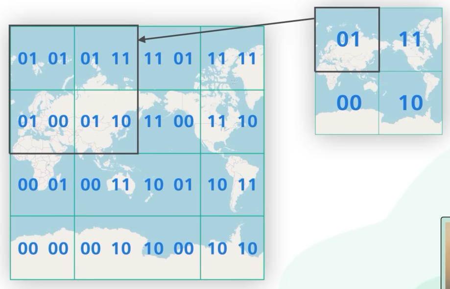
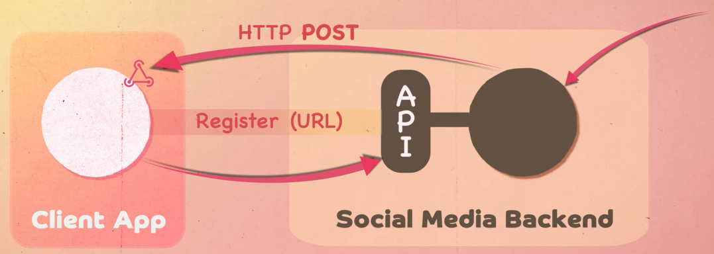

*[English](README.md) ∙ [日本語](README-ja.md) ∙ [简体中文](README-zh-Hans.md) ∙ [繁體中文](README-zh-TW.md) | [العَرَبِيَّة‎](https://github.com/donnemartin/system-design-primer/issues/170) ∙ [বাংলা](https://github.com/donnemartin/system-design-primer/issues/220) ∙ [Português do Brasil](https://github.com/donnemartin/system-design-primer/issues/40) ∙ [Deutsch](https://github.com/donnemartin/system-design-primer/issues/186) ∙ [ελληνικά](https://github.com/donnemartin/system-design-primer/issues/130) ∙ [עברית](https://github.com/donnemartin/system-design-primer/issues/272) ∙ [Italiano](https://github.com/donnemartin/system-design-primer/issues/104) ∙ [한국어](https://github.com/donnemartin/system-design-primer/issues/102) ∙ [فارسی](https://github.com/donnemartin/system-design-primer/issues/110) ∙ [Polski](https://github.com/donnemartin/system-design-primer/issues/68) ∙ [русский язык](https://github.com/donnemartin/system-design-primer/issues/87) ∙ [Español](https://github.com/donnemartin/system-design-primer/issues/136) ∙ [ภาษาไทย](https://github.com/donnemartin/system-design-primer/issues/187) ∙ [Türkçe](https://github.com/donnemartin/system-design-primer/issues/39) ∙ [tiếng Việt](https://github.com/donnemartin/system-design-primer/issues/127) ∙ [Français](https://github.com/donnemartin/system-design-primer/issues/250) | [Add Translation](https://github.com/donnemartin/system-design-primer/issues/28)*

**Help [translate](TRANSLATIONS.md) this guide!**

# The System Design Primer

<p align="center">
  
  <br/>
</p>

## Motivation

> Learn how to design large-scale systems.
>
> Prep for the system design interview.

### Learn how to design large-scale systems

Learning how to design scalable systems will help you become a better engineer.

System design is a broad topic.  There is a **vast amount of resources scattered throughout the web** on system design principles.

This repo is an **organized collection** of resources to help you learn how to build systems at scale.

### Learn from the open source community

This is a continually updated, open source project.

[Contributions](#contributing) are welcome!

### Prep for the system design interview

In addition to coding interviews, system design is a **required component** of the **technical interview process** at many tech companies.

**Practice common system design interview questions** and **compare** your results with **sample solutions**: discussions, code, and diagrams.

Additional topics for interview prep:

* [Study guide](#study-guide)
* [How to approach a system design interview question](#how-to-approach-a-system-design-interview-question)
* [System design interview questions, **with solutions**](#system-design-interview-questions-with-solutions)
* [Object-oriented design interview questions, **with solutions**](#object-oriented-design-interview-questions-with-solutions)
* [Additional system design interview questions](#additional-system-design-interview-questions)

## Anki flashcards

<p align="center">
  
  <br/>
</p>

The provided [Anki flashcard decks](https://apps.ankiweb.net/) use spaced repetition to help you retain key system design concepts.

* [System design deck](https://github.com/donnemartin/system-design-primer/tree/master/resources/flash_cards/System%20Design.apkg)
* [System design exercises deck](https://github.com/donnemartin/system-design-primer/tree/master/resources/flash_cards/System%20Design%20Exercises.apkg)
* [Object oriented design exercises deck](https://github.com/donnemartin/system-design-primer/tree/master/resources/flash_cards/OO%20Design.apkg)

Great for use while on-the-go.

### Coding Resource: Interactive Coding Challenges

Looking for resources to help you prep for the [**Coding Interview**](https://github.com/donnemartin/interactive-coding-challenges)?

<p align="center">
  
  <br/>
</p>

Check out the sister repo [**Interactive Coding Challenges**](https://github.com/donnemartin/interactive-coding-challenges), which contains an additional Anki deck:

* [Coding deck](https://github.com/donnemartin/interactive-coding-challenges/tree/master/anki_cards/Coding.apkg)

## Contributing

> Learn from the community.

Feel free to submit pull requests to help:

* Fix errors
* Improve sections
* Add new sections
* [Translate](https://github.com/donnemartin/system-design-primer/issues/28)

Content that needs some polishing is placed [under development](#under-development).

Review the [Contributing Guidelines](CONTRIBUTING.md).

## Index of system design topics

> Summaries of various system design topics, including pros and cons.  **Everything is a trade-off**.
>
> Each section contains links to more in-depth resources.

<p align="center">
  
  <br/>
</p>

* [Low-Level Design](#low-level-design)
    * [SOLID, DRY and KISS](#solid-dry-and-kiss)
    * [Design Patterns](#design-patterns)
* [System design topics: start here](#system-design-topics-start-here)
    * [Step 1: Review the scalability video lecture](#step-1-review-the-scalability-video-lecture)
    * [Step 2: Review the scalability article](#step-2-review-the-scalability-article)
    * [Next steps](#next-steps)
* [Performance vs scalability](#performance-vs-scalability)
* [Latency vs throughput](#latency-vs-throughput)
* [Availability vs consistency](#availability-vs-consistency)
    * [CAP theorem](#cap-theorem)
        * [CP - consistency and partition tolerance](#cp---consistency-and-partition-tolerance)
        * [AP - availability and partition tolerance](#ap---availability-and-partition-tolerance)
* [Consistency patterns](#consistency-patterns)
    * [Weak consistency](#weak-consistency)
    * [Eventual consistency](#eventual-consistency)
    * [Strong consistency](#strong-consistency)
* [Availability patterns](#availability-patterns)
    * [Fail-over](#fail-over)
    * [Replication](#replication)
    * [Availability in numbers](#availability-in-numbers)
* [Domain name system](#domain-name-system)
* [Content delivery network](#content-delivery-network)
    * [Push CDNs](#push-cdns)
    * [Pull CDNs](#pull-cdns)
* [Load balancer](#load-balancer)
    * [Active-passive](#active-passive)
    * [Active-active](#active-active)
    * [Layer 4 load balancing](#layer-4-load-balancing)
    * [Layer 7 load balancing](#layer-7-load-balancing)
    * [Horizontal scaling](#horizontal-scaling)
* [Reverse proxy (web server)](#reverse-proxy-web-server)
    * [Load balancer vs reverse proxy](#load-balancer-vs-reverse-proxy)
* [Application layer](#application-layer)
    * [Microservices](#microservices)
    * [Service discovery](#service-discovery)
    * [Containerization (Docker and Kubernetes)](#containerization-docker-and-kubernetes)
* [Database](#database)
    * [Relational database management system (RDBMS)](#relational-database-management-system-rdbms)
        * [Master-slave replication](#master-slave-replication)
        * [Master-master replication](#master-master-replication)
        * [Leaderless replication](#leaderless-replication)
        * [Federation](#federation)
        * [Sharding](#sharding)
        * [Denormalization](#denormalization)
        * [SQL tuning](#sql-tuning)
    * [NoSQL](#nosql)
        * [Key-value store](#key-value-store)
        * [Document store](#document-store)
        * [Wide column store](#wide-column-store)
        * [Graph Database](#graph-database)
    * [SQL or NoSQL](#sql-or-nosql)
    * [Search Indexes](#search-indexes)
    * [GeoSpatial Databases](#geospatial-databases)
* [Cache](#cache)
    * [Client caching](#client-caching)
    * [CDN caching](#cdn-caching)
    * [Web server caching](#web-server-caching)
    * [Database caching](#database-caching)
    * [Application caching](#application-caching)
    * [Caching at the database query level](#caching-at-the-database-query-level)
    * [Caching at the object level](#caching-at-the-object-level)
    * [When to update the cache](#when-to-update-the-cache)
        * [Cache-aside](#cache-aside)
        * [Write-through](#write-through)
        * [Write-behind (write-back)](#write-behind-write-back)
        * [Refresh-ahead](#refresh-ahead)
        * [Caching: In a Nutshell](#caching-in-a-nutshell)
* [Asynchronism](#asynchronism)
    * [In-Memory Message Brokers (Message Queues)](#in-memory-message-brokers-message-queues)
    * [Log-Based Message Brokers](#log-based-message-brokers)
    * [Task queues](#task-queues)
    * [Back pressure](#back-pressure)
    * [Batch Processing](#batch-processing)
* [Communication](#communication)
    * [Hypertext transfer protocol (HTTP)](#hypertext-transfer-protocol-http)
    * [HTTP Long and Short Polling](#http-long-and-short-polling)
    * [WebSockets (WSS)](#websockets-wss)
    * [Server-Sent Events (SSE)](#server-sent-events)
    * [WebRTC](#webrtc)
    * [Transmission control protocol (TCP)](#transmission-control-protocol-tcp)
    * [User datagram protocol (UDP)](#user-datagram-protocol-udp)
    * [Remote procedure call (RPC)](#remote-procedure-call-rpc)
    * [Representational state transfer (REST)](#representational-state-transfer-rest)
* [Security](#security)
* [Appendix](#appendix)
    * [Powers of two table](#powers-of-two-table)
    * [Latency numbers every programmer should know](#latency-numbers-every-programmer-should-know)
    * [Additional system design interview questions](#additional-system-design-interview-questions)
    * [Real world architectures](#real-world-architectures)
    * [Company architectures](#company-architectures)
    * [Company engineering blogs](#company-engineering-blogs)
* [Under development](#under-development)
* [Credits](#credits)
* [Contact info](#contact-info)
* [License](#license)

## Study guide

> Suggested topics to review based on your interview timeline (short, medium, long).


**Q: For interviews, do I need to know everything here?**

**A: No, you don't need to know everything here to prepare for the interview**.

What you are asked in an interview depends on variables such as:

* How much experience you have
* What your technical background is
* What positions you are interviewing for
* Which companies you are interviewing with
* Luck

More experienced candidates are generally expected to know more about system design.  Architects or team leads might be expected to know more than individual contributors.  Top tech companies are likely to have one or more design interview rounds.

Start broad and go deeper in a few areas.  It helps to know a little about various key system design topics.  Adjust the following guide based on your timeline, experience, what positions you are interviewing for, and which companies you are interviewing with.

* **Short timeline** - Aim for **breadth** with system design topics.  Practice by solving **some** interview questions.
* **Medium timeline** - Aim for **breadth** and **some depth** with system design topics.  Practice by solving **many** interview questions.
* **Long timeline** - Aim for **breadth** and **more depth** with system design topics.  Practice by solving **most** interview questions.

| | Short | Medium | Long |
|---|---|---|---|
| Read through the [System design topics](#index-of-system-design-topics) to get a broad understanding of how systems work | :+1: | :+1: | :+1: |
| Read through a few articles in the [Company engineering blogs](#company-engineering-blogs) for the companies you are interviewing with | :+1: | :+1: | :+1: |
| Read through a few [Real world architectures](#real-world-architectures) | :+1: | :+1: | :+1: |
| Review [How to approach a system design interview question](#how-to-approach-a-system-design-interview-question) | :+1: | :+1: | :+1: |
| Work through [System design interview questions with solutions](#system-design-interview-questions-with-solutions) | Some | Many | Most |
| Work through [Object-oriented design interview questions with solutions](#object-oriented-design-interview-questions-with-solutions) | Some | Many | Most |
| Review [Additional system design interview questions](#additional-system-design-interview-questions) | Some | Many | Most |

## How to approach a system design interview question

> How to tackle a system design interview question.

The system design interview is an **open-ended conversation**.  You are expected to lead it.

You can use the following steps to guide the discussion.  To help solidify this process, work through the [System design interview questions with solutions](#system-design-interview-questions-with-solutions) section using the following steps.

### Step 1: Outline use cases, constraints, and assumptions

Gather requirements and scope the problem.  Ask questions to clarify use cases and constraints.  Discuss assumptions.
Fundamentally we want to list the **Functional** and **Non-Functional** Requirements

|               Functional               |                                                            |              Non-Functional          |                                                  |
|                 :---:                  |                         :----:                             |                  :---:               |                         :---:                    |
|               **Users**                |                 **Scale (Read/Write)**                     |             **Performance**          |                       **Cost**                   |
|  Who is going to use it and for what?  |                How many users are there?                   |       Availability vs Consistency    |    Should we minimise the cost of development?   |
|                                        |            Read heavy or write heavy (in qps)?             |          Latency vs Throughput       |    Should we minimise the cost of maintenance?   |
|                                        |       Can there be spikes in either? (special events?)     |                                      |                                                  |

[Source](https://www.youtube.com/watch?v=bUHFg8CZFws&pp=ygUXU3lzdGVtIERlc2lnbiBJbnRlcnZpZXc%3D)

#### Cost
- **_Minimising Development Cost:_** Rely more on open source frameworks
- **_Minimising Maintenance Cost:_** Rely more on public cloud services

### Step 2: Back-of-the-envelope calculations

There are three main metrics that you will want to consider in your answer:
1. QPS
    * (DAU (Daily Active Users) * Num Reqs Per User) / 100000 (~Num seconds per day)
2. Total Storage Per Year
    * DAU * % of writing users (derived from read-write ratio) * num writes in a year * size of avg write
3. Bandwidth (Optional)
    * Size of avg write * QPS

You might be asked to do some estimates by hand.  Refer to the [Appendix](#appendix) for the following resources:

* [Use back of the envelope calculations](http://highscalability.com/blog/2011/1/26/google-pro-tip-use-back-of-the-envelope-calculations-to-choo.html)
* [Powers of two table](#powers-of-two-table)
* [Latency numbers every programmer should know](#latency-numbers-every-programmer-should-know)

### Step 3: Data Model Design

* What are our DB tables going to look like? (Stick to an SQL format - this schema can be adapted to other choices of database)

### Step 4: API Design

* What are some of our API calls going to look like?
  * You should ideally sketch this out, and highlight how the data model is influencing your API design

### Step 5: Create a high-level design

Outline a high-level design with all important components.

* Sketch the main components and connections
* Justify your ideas

### Step 6: Design core components

Dive into details for each core component.  For example, if you were asked to [design a url shortening service](solutions/system_design/pastebin/README.md), discuss:

* Generating and storing a hash of the full url
    * [MD5](solutions/system_design/pastebin/README.md) and [Base62](solutions/system_design/pastebin/README.md)
    * Hash collisions
    * SQL or NoSQL
    * Database schema
* Translating a hashed url to the full url
    * Database lookup
* API and object-oriented design

### Step 7: Scale the design

Identify and address bottlenecks, given the constraints.  For example, do you need the following to address scalability issues?

* Load balancer
* Horizontal scaling
* Caching
* Database sharding

Discuss potential solutions and trade-offs. Everything is a trade-off. Address bottlenecks using [principles of scalable system design](#index-of-system-design-topics).

### Source(s) and further reading

Check out the following links to get a better idea of what to expect:

* [Acing Amazon System Design Interview](https://www.youtube.com/watch?v=KjM1kWCGef8)
* [How to ace a systems design interview](https://www.palantir.com/2011/10/how-to-rock-a-systems-design-interview/)
* [The system design interview](http://www.hiredintech.com/system-design)
* [Intro to Architecture and Systems Design Interviews](https://www.youtube.com/watch?v=ZgdS0EUmn70)
* [System design template](https://leetcode.com/discuss/career/229177/My-System-Design-Template)
* [What is a Web Server?](https://www.youtube.com/watch?v=9J1nJOivdyw)

## System design interview questions with solutions

> Common system design interview questions with sample discussions, code, and diagrams.
>
> Solutions linked to content in the `solutions/` folder.

| Question | |
|---|---|
| Design Pastebin.com (or Bit.ly) | [Solution](solutions/system_design/pastebin/README.md) |
| Design the Twitter timeline and search (or Facebook feed and search) | [Solution](solutions/system_design/twitter/README.md) |
| Design a web crawler | [Solution](solutions/system_design/web_crawler/README.md) |
| Design Mint.com | [Solution](solutions/system_design/mint/README.md) |
| Design the data structures for a social network | [Solution](solutions/system_design/social_graph/README.md) |
| Design a key-value store for a search engine | [Solution](solutions/system_design/query_cache/README.md) |
| Design Amazon's sales ranking by category feature | [Solution](solutions/system_design/sales_rank/README.md) |
| Design a system that scales to millions of users on AWS | [Solution](solutions/system_design/scaling_aws/README.md) |
| Add a system design question | [Contribute](#contributing) |

### Design Pastebin.com (or Bit.ly)

[View exercise and solution](solutions/system_design/pastebin/README.md)


### Design the Twitter timeline and search (or Facebook feed and search)

[View exercise and solution](solutions/system_design/twitter/README.md)


### Design a web crawler

[View exercise and solution](solutions/system_design/web_crawler/README.md)


### Design Mint.com

[View exercise and solution](solutions/system_design/mint/README.md)


### Design the data structures for a social network

[View exercise and solution](solutions/system_design/social_graph/README.md)


### Design a key-value store for a search engine

[View exercise and solution](solutions/system_design/query_cache/README.md)


### Design Amazon's sales ranking by category feature

[View exercise and solution](solutions/system_design/sales_rank/README.md)


### Design a system that scales to millions of users on AWS

[View exercise and solution](solutions/system_design/scaling_aws/README.md)


## Object-oriented design interview questions with solutions

> Common object-oriented design interview questions with sample discussions, code, and diagrams.
>
> Solutions linked to content in the `solutions/` folder.

>**Note: This section is under development**

| Question | |
|---|---|
| Design a hash map | [Solution](solutions/object_oriented_design/hash_table/hash_map.ipynb)  |
| Design a least recently used cache | [Solution](solutions/object_oriented_design/lru_cache/lru_cache.ipynb)  |
| Design a call center | [Solution](solutions/object_oriented_design/call_center/call_center.ipynb)  |
| Design a deck of cards | [Solution](solutions/object_oriented_design/deck_of_cards/deck_of_cards.ipynb)  |
| Design a parking lot | [Solution](solutions/object_oriented_design/parking_lot/parking_lot.ipynb)  |
| Design a chat server | [Solution](solutions/object_oriented_design/online_chat/online_chat.ipynb)  |
| Design a circular array | [Contribute](#contributing)  |
| Add an object-oriented design question | [Contribute](#contributing) |

## Low-Level Design

### SOLID, DRY and KISS

This section needs to be updated...

### Design Patterns

This section needs to be updated...

## System design topics: start here

New to system design?

First, you'll need a basic understanding of common principles, learning about what they are, how they are used, and their pros and cons.

### Step 1: Review the scalability video lecture

[Scalability Lecture at Harvard](https://www.youtube.com/watch?v=-W9F__D3oY4)

* Topics covered:
    * Vertical scaling
    * Horizontal scaling
    * Caching
    * Load balancing
    * Database replication
    * Database partitioning

### Step 2: Review the scalability article

[Scalability](https://web.archive.org/web/20221030091841/http://www.lecloud.net/tagged/scalability/chrono)

* Topics covered:
    * [Clones](https://web.archive.org/web/20220530193911/https://www.lecloud.net/post/7295452622/scalability-for-dummies-part-1-clones)
    * [Databases](https://web.archive.org/web/20220602114024/https://www.lecloud.net/post/7994751381/scalability-for-dummies-part-2-database)
    * [Caches](https://web.archive.org/web/20230126233752/https://www.lecloud.net/post/9246290032/scalability-for-dummies-part-3-cache)
    * [Asynchronism](https://web.archive.org/web/20220926171507/https://www.lecloud.net/post/9699762917/scalability-for-dummies-part-4-asynchronism)

### Next steps

Next, we'll look at high-level trade-offs:

* **Performance** vs **scalability**
* **Latency** vs **throughput**
* **Availability** vs **consistency**

Keep in mind that **everything is a trade-off**.

Then we'll dive into more specific topics such as DNS, CDNs, and load balancers.

## Performance vs scalability

A service is **scalable** if it results in increased **performance** in a manner proportional to resources added. Generally, increasing performance means serving more units of work, but it can also be to handle larger units of work, such as when datasets grow.<sup><a href=http://www.allthingsdistributed.com/2006/03/a_word_on_scalability.html>1</a></sup>

Another way to look at performance vs scalability:

* If you have a **performance** problem, your system is slow for a single user.
* If you have a **scalability** problem, your system is fast for a single user but slow under heavy load.

### Source(s) and further reading

* [A word on scalability](http://www.allthingsdistributed.com/2006/03/a_word_on_scalability.html)
* [Scalability, availability, stability, patterns](http://www.slideshare.net/jboner/scalability-availability-stability-patterns/)

## Latency vs throughput

**Latency** is the time to perform some action or to produce some result.

**Throughput** is the number of such actions or results per unit of time.

Generally, you should aim for **maximal throughput** with **acceptable latency**.

### Source(s) and further reading

* [Understanding latency vs throughput](https://community.cadence.com/cadence_blogs_8/b/fv/posts/understanding-latency-vs-throughput)

## Availability vs consistency

### CAP theorem

<p align="center">
  
  <br/>
  <i><a href=http://robertgreiner.com/2014/08/cap-theorem-revisited>Source: CAP theorem revisited</a></i>
</p>

In a distributed computer system, you can only support two of the following guarantees:

* **Consistency** - Every read receives the most recent write or an error
* **Availability** - Every request receives a response, without guarantee that it contains the most recent version of the information
* **Partition Tolerance** - The system continues to operate despite arbitrary partitioning due to network failures

*Networks aren't reliable, so you'll need to support partition tolerance.  You'll need to make a software tradeoff between consistency and availability.*

#### CP - consistency and partition tolerance

Waiting for a response from the partitioned node might result in a timeout error.  CP is a good choice if your business needs require atomic reads and writes.

#### AP - availability and partition tolerance

Responses return the most readily available version of the data available on any node, which might not be the latest.  Writes might take some time to propagate when the partition is resolved.

AP is a good choice if the business needs to allow for [eventual consistency](#eventual-consistency) or when the system needs to continue working despite external errors.

### Source(s) and further reading

* [CAP theorem revisited](http://robertgreiner.com/2014/08/cap-theorem-revisited/)
* [A plain english introduction to CAP theorem](http://ksat.me/a-plain-english-introduction-to-cap-theorem)
* [CAP FAQ](https://github.com/henryr/cap-faq)
* [The CAP theorem](https://www.youtube.com/watch?v=k-Yaq8AHlFA)

## Consistency patterns

With multiple copies of the same data, we are faced with options on how to synchronize them so clients have a consistent view of the data.  Recall the definition of consistency from the [CAP theorem](#cap-theorem) - Every read receives the most recent write or an error.

### Weak consistency

After a write, reads may or may not see it.  A best effort approach is taken.

This approach is seen in systems such as memcached.  Weak consistency works well in real time use cases such as VoIP, video chat, and realtime multiplayer games.  For example, if you are on a phone call and lose reception for a few seconds, when you regain connection you do not hear what was spoken during connection loss.

### Eventual consistency

After a write, reads will eventually see it (typically within milliseconds).  Data is replicated asynchronously.

This approach is seen in systems such as DNS and email.  Eventual consistency works well in highly available systems.

### Strong consistency

After a write, reads will see it.  Data is replicated synchronously.

This approach is seen in file systems and RDBMSes.  Strong consistency works well in systems that need transactions.

### Source(s) and further reading

* [Transactions across data centers](http://snarfed.org/transactions_across_datacenters_io.html)

## Availability patterns

There are two complementary patterns to support high availability: **fail-over** and **replication**.

### Fail-over

#### Active-passive

With active-passive fail-over, heartbeats are sent between the active and the passive server on standby.  If the heartbeat is interrupted, the passive server takes over the active's IP address and resumes service.

The length of downtime is determined by whether the passive server is already running in 'hot' standby or whether it needs to start up from 'cold' standby.  Only the active server handles traffic.

Active-passive failover can also be referred to as master-slave failover.

#### Active-active

In active-active, both servers are managing traffic, spreading the load between them.

If the servers are public-facing, the DNS would need to know about the public IPs of both servers.  If the servers are internal-facing, application logic would need to know about both servers.

Active-active failover can also be referred to as master-master failover.

### Disadvantage(s): failover

* Fail-over adds more hardware and additional complexity.
* There is a potential for loss of data if the active system fails before any newly written data can be replicated to the passive.

### Replication

#### Master-slave and master-master

This topic is further discussed in the [Database](#database) section:

* [Master-slave replication](#master-slave-replication)
* [Master-master replication](#master-master-replication)

### Failover vs Replication

Failover mechanisms are typically associated with ensuring continuous availability and reliability of active, running services by automatically redirecting traffic or operations in case of failures. 

On the other hand, replication is more about maintaining redundant copies of data across multiple systems or locations to ensure data availability, consistency, and scalability. Both concepts are essential components of designing resilient and reliable systems.

### Availability in numbers

Availability is often quantified by uptime (or downtime) as a percentage of time the service is available.  Availability is generally measured in number of 9s--a service with 99.99% availability is described as having four 9s.

#### 99.9% availability - three 9s

| Duration            | Acceptable downtime|
|---------------------|--------------------|
| Downtime per year   | 8h 45min 57s       |
| Downtime per month  | 43m 49.7s          |
| Downtime per week   | 10m 4.8s           |
| Downtime per day    | 1m 26.4s           |

#### 99.99% availability - four 9s

| Duration            | Acceptable downtime|
|---------------------|--------------------|
| Downtime per year   | 52min 35.7s        |
| Downtime per month  | 4m 23s             |
| Downtime per week   | 1m 5s              |
| Downtime per day    | 8.6s               |

#### Availability in parallel vs in sequence

If a service consists of multiple components prone to failure, the service's overall availability depends on whether the components are in sequence or in parallel.

###### In sequence

Overall availability decreases when two components with availability < 100% are in sequence:

```
Availability (Total) = Availability (Foo) * Availability (Bar)
```

If both `Foo` and `Bar` each had 99.9% availability, their total availability in sequence would be 99.8%.

###### In parallel

Overall availability increases when two components with availability < 100% are in parallel:

```
Availability (Total) = 1 - (1 - Availability (Foo)) * (1 - Availability (Bar))
```

If both `Foo` and `Bar` each had 99.9% availability, their total availability in parallel would be 99.9999%.

## Domain name system

<p align="center">
  
  <br/>
  <i><a href=http://www.slideshare.net/srikrupa5/dns-security-presentation-issa>Source: DNS security presentation</a></i>
</p>

A Domain Name System (DNS) translates a domain name such as www.example.com to an IP address.

DNS is hierarchical, with a few authoritative servers at the top level.  Your router or ISP provides information about which DNS server(s) to contact when doing a lookup.  Lower level DNS servers cache mappings, which could become stale due to DNS propagation delays.  DNS results can also be cached by your browser or OS for a certain period of time, determined by the [time to live (TTL)](https://en.wikipedia.org/wiki/Time_to_live).

* **NS record (name server)** - Specifies the DNS servers for your domain/subdomain.
* **MX record (mail exchange)** - Specifies the mail servers for accepting messages.
* **A record (address)** - Points a name to an IP address.
* **CNAME (canonical)** - Points a name to another name or `CNAME` (example.com to www.example.com) or to an `A` record.

Services such as [CloudFlare](https://www.cloudflare.com/dns/) and [Route 53](https://aws.amazon.com/route53/) provide managed DNS services.  Some DNS services can route traffic through various methods:

* [Weighted round robin](https://www.jscape.com/blog/load-balancing-algorithms)
    * Prevent traffic from going to servers under maintenance
    * Balance between varying cluster sizes
    * A/B testing
* [Latency-based](https://docs.aws.amazon.com/Route53/latest/DeveloperGuide/routing-policy.html#routing-policy-latency)
* [Geolocation-based](https://docs.aws.amazon.com/Route53/latest/DeveloperGuide/routing-policy.html#routing-policy-geo)

### Disadvantage(s): DNS

* Accessing a DNS server introduces a slight delay, although mitigated by caching described above.
* DNS server management could be complex and is generally managed by [governments, ISPs, and large companies](http://superuser.com/questions/472695/who-controls-the-dns-servers/472729).
* DNS services have recently come under [DDoS attack](http://dyn.com/blog/dyn-analysis-summary-of-friday-october-21-attack/), preventing users from accessing websites such as Twitter without knowing Twitter's IP address(es).

### Source(s) and further reading

* [DNS architecture](https://technet.microsoft.com/en-us/library/dd197427(v=ws.10).aspx)
* [Wikipedia](https://en.wikipedia.org/wiki/Domain_Name_System)
* [DNS articles](https://support.dnsimple.com/categories/dns/)

## Content delivery network

<p align="center">
  
  <br/>
  <i><a href=https://www.creative-artworks.eu/why-use-a-content-delivery-network-cdn/>Source: Why use a CDN</a></i>
</p>

A content delivery network (CDN) is a globally distributed network of proxy servers, serving content from locations closer to the user.  Generally, static files such as HTML/CSS/JS, photos, and videos are served from CDN, although some CDNs such as Amazon's CloudFront support dynamic content.  The site's DNS resolution will tell clients which server to contact.

Serving content from CDNs can significantly improve performance in two ways:

* Users receive content from data centers close to them
* Your servers do not have to serve requests that the CDN fulfills

### Push CDNs

Push CDNs receive new content whenever changes occur on your server.  You take full responsibility for providing content, uploading directly to the CDN and rewriting URLs to point to the CDN.  You can configure when content expires and when it is updated.  Content is uploaded only when it is new or changed, minimizing traffic, but maximizing storage.

Sites with a small amount of traffic or sites with content that isn't often updated work well with push CDNs.  Content is placed on the CDNs once, instead of being re-pulled at regular intervals.

### Pull CDNs

Pull CDNs grab new content from your server when the first user requests the content.  You leave the content on your server and rewrite URLs to point to the CDN.  This results in a slower request until the content is cached on the CDN.

A [time-to-live (TTL)](https://en.wikipedia.org/wiki/Time_to_live) determines how long content is cached.  Pull CDNs minimize storage space on the CDN, but can create redundant traffic if files expire and are pulled before they have actually changed.

Sites with heavy traffic work well with pull CDNs, as traffic is spread out more evenly with only recently requested content remaining on the CDN.

### Disadvantage(s): CDN

* CDN costs could be significant depending on traffic, although this should be weighed with additional costs you would incur not using a CDN.
* Content might be stale if it is updated before the TTL expires it.
* CDNs require changing URLs for static content to point to the CDN.

### Source(s) and further reading

* [Video By Exponent](https://www.youtube.com/watch?v=rwBv7FqZ77g) -> Pull CDNs are much more widely used due to the ease of maintenance
* [Globally distributed content delivery](https://figshare.com/articles/Globally_distributed_content_delivery/6605972)
* [The differences between push and pull CDNs](http://www.travelblogadvice.com/technical/the-differences-between-push-and-pull-cdns/)
* [Wikipedia](https://en.wikipedia.org/wiki/Content_delivery_network)

## Load balancer

<p align="center">
  
  <br/>
  <i><a href=http://horicky.blogspot.com/2010/10/scalable-system-design-patterns.html>Source: Scalable system design patterns</a></i>
</p>

Load balancers distribute incoming client requests to computing resources such as application servers and databases.  In each case, the load balancer returns the response from the computing resource to the appropriate client.  Load balancers are effective at:

* Preventing requests from going to unhealthy servers
* Preventing overloading resources
* Helping to eliminate a single point of failure

Load balancers can be implemented with hardware (expensive) or with software such as HAProxy.

Additional benefits include:

* **SSL termination** - Decrypt incoming requests and encrypt server responses so backend servers do not have to perform these potentially expensive operations
    * Removes the need to install [X.509 certificates](https://en.wikipedia.org/wiki/X.509) on each server
* **Session persistence** - Issue cookies and route a specific client's requests to same instance if the web apps do not keep track of sessions

To protect against failures, it's common to set up multiple load balancers, either in [active-passive](#active-passive) or [active-active](#active-active) mode.

Load balancers can route traffic based on various metrics, including:

* Random
* Least loaded
* Session/cookies
* [Round robin or weighted round robin](https://www.g33kinfo.com/info/round-robin-vs-weighted-round-robin-lb)
* [Layer 4](#layer-4-load-balancing)
* [Layer 7](#layer-7-load-balancing)

### Layer 4 load balancing

Layer 4 load balancers look at info at the [transport layer](#communication) to decide how to distribute requests.  Generally, this involves the source, destination IP addresses, and ports in the header, but not the contents of the packet.  Layer 4 load balancers forward network packets to and from the upstream server, performing [Network Address Translation (NAT)](https://www.nginx.com/resources/glossary/layer-4-load-balancing/).

### Layer 7 load balancing

Layer 7 load balancers look at the [application layer](#communication) to decide how to distribute requests.  This can involve contents of the header, message, and cookies.  Layer 7 load balancers terminate network traffic, reads the message, makes a load-balancing decision, then opens a connection to the selected server.  For example, a layer 7 load balancer can direct video traffic to servers that host videos while directing more sensitive user billing traffic to security-hardened servers.

At the cost of flexibility, layer 4 load balancing requires less time and computing resources than Layer 7, although the performance impact can be minimal on modern commodity hardware.

### Horizontal scaling

Load balancers can also help with horizontal scaling, improving performance and availability.  Scaling out using commodity machines is more cost efficient and results in higher availability than scaling up a single server on more expensive hardware, called **Vertical Scaling**.  It is also easier to hire for talent working on commodity hardware than it is for specialized enterprise systems.

#### Disadvantage(s): horizontal scaling

* Scaling horizontally introduces complexity and involves cloning servers
    * Servers should be stateless: they should not contain any user-related data like sessions or profile pictures
    * Sessions can be stored in a centralized data store such as a [database](#database) (SQL, NoSQL) or a persistent [cache](#cache) (Redis, Memcached)
* Downstream servers such as caches and databases need to handle more simultaneous connections as upstream servers scale out

### Disadvantage(s): load balancer

* The load balancer can become a performance bottleneck if it does not have enough resources or if it is not configured properly.
* Introducing a load balancer to help eliminate a single point of failure results in increased complexity.
* A single load balancer is a single point of failure, configuring multiple load balancers further increases complexity.

### Source(s) and further reading

* [NGINX architecture](https://www.nginx.com/blog/inside-nginx-how-we-designed-for-performance-scale/)
* [HAProxy architecture guide](http://www.haproxy.org/download/1.2/doc/architecture.txt)
* [Scalability](http://www.lecloud.net/post/7295452622/scalability-for-dummies-part-1-clones)
* [Wikipedia](https://en.wikipedia.org/wiki/Load_balancing_(computing))
* [Layer 4 load balancing](https://www.nginx.com/resources/glossary/layer-4-load-balancing/)
* [Layer 7 load balancing](https://www.nginx.com/resources/glossary/layer-7-load-balancing/)
* [ELB listener config](http://docs.aws.amazon.com/elasticloadbalancing/latest/classic/elb-listener-config.html)

## Reverse proxy (web server)

<p align="center">
  
  <br/>
  <i><a href=https://upload.wikimedia.org/wikipedia/commons/6/67/Reverse_proxy_h2g2bob.svg>Source: Wikipedia</a></i>
  <br/>
</p>

A reverse proxy is a web server that centralizes internal services and provides unified interfaces to the public.  Requests from clients are forwarded to a server that can fulfill it before the reverse proxy returns the server's response to the client.

Additional benefits include:

* **Increased security** - Hide information about backend servers, blacklist IPs, limit number of connections per client
* **Increased scalability and flexibility** - Clients only see the reverse proxy's IP, allowing you to scale servers or change their configuration
* **SSL termination** - Decrypt incoming requests and encrypt server responses so backend servers do not have to perform these potentially expensive operations
    * Removes the need to install [X.509 certificates](https://en.wikipedia.org/wiki/X.509) on each server
* **Compression** - Compress server responses
* **Caching** - Return the response for cached requests
* **Static content** - Serve static content directly
    * HTML/CSS/JS
    * Photos
    * Videos
    * Etc

### Load balancer vs reverse proxy

* Deploying a load balancer is useful when you have multiple servers.  Often, load balancers  route traffic to a set of servers serving the same function.
* Reverse proxies can be useful even with just one web server or application server, opening up the benefits described in the previous section.
* Solutions such as NGINX and HAProxy can support both layer 7 reverse proxying and load balancing.

### Disadvantage(s): reverse proxy

* Introducing a reverse proxy results in increased complexity.
* A single reverse proxy is a single point of failure, configuring multiple reverse proxies (ie a [failover](https://en.wikipedia.org/wiki/Failover)) further increases complexity.

### Source(s) and further reading

* [Reverse proxy vs load balancer](https://www.nginx.com/resources/glossary/reverse-proxy-vs-load-balancer/)
* [NGINX architecture](https://www.nginx.com/blog/inside-nginx-how-we-designed-for-performance-scale/)
* [HAProxy architecture guide](http://www.haproxy.org/download/1.2/doc/architecture.txt)
* [Wikipedia](https://en.wikipedia.org/wiki/Reverse_proxy)

## Application layer

<p align="center">
  
  <br/>
  <i><a href=http://lethain.com/introduction-to-architecting-systems-for-scale/#platform_layer>Source: Intro to architecting systems for scale</a></i>
</p>

Separating out the web layer from the application layer (also known as platform layer) allows you to scale and configure both layers independently.  Adding a new API results in adding application servers without necessarily adding additional web servers.  The **single responsibility principle** advocates for small and autonomous services that work together.  Small teams with small services can plan more aggressively for rapid growth.

Workers in the application layer also help enable [asynchronism](#asynchronism).

### Microservices

Related to this discussion are [microservices](https://en.wikipedia.org/wiki/Microservices), which can be described as a suite of independently deployable, small, modular services.  Each service runs a unique process and communicates through a well-defined, lightweight mechanism to serve a business goal. <sup><a href=https://smartbear.com/learn/api-design/what-are-microservices>1</a></sup>

Pinterest, for example, could have the following microservices: user profile, follower, feed, search, photo upload, etc.

### Service Discovery

Systems such as [Consul](https://www.consul.io/docs/index.html), [Etcd](https://coreos.com/etcd/docs/latest), and [Zookeeper](http://www.slideshare.net/sauravhaloi/introduction-to-apache-zookeeper) can help services find each other by keeping track of registered names, addresses, and ports.  [Health checks](https://www.consul.io/intro/getting-started/checks.html) help verify service integrity and are often done using an [HTTP](#hypertext-transfer-protocol-http) endpoint.  Both Consul and Etcd have a built in [key-value store](#key-value-store) that can be useful for storing config values and other shared data.

### Containerization (Docker and Kubernetes)

A container is a technology that allows you to package your application code, dependencies, environment variables, configuration settings, etc. into a single bundle.

You can then share this bundle (called a container image) with other developers who need to run your application. It makes deploying your code significantly easier.

Some benefits of using containers are:
* Consistent Development Environments
* Simplified Dependency Management
* Faster Onboarding for New Devs
* Reproducible Builds
* Easier Scalability
* Portability
* Easier Versioning & Rollbacks
* Configuration Management

These are all benefits of using containers like Docker or LXC.

### Disadvantage(s): application layer

* Adding an application layer with loosely coupled services requires a different approach from an architectural, operations, and process viewpoint (vs a monolithic system).
* Microservices can add complexity in terms of deployments and operations.

### Source(s) and further reading

* [Intro to architecting systems for scale](http://lethain.com/introduction-to-architecting-systems-for-scale)
* [Crack the system design interview](http://www.puncsky.com/blog/2016-02-13-crack-the-system-design-interview)
* [Service oriented architecture](https://en.wikipedia.org/wiki/Service-oriented_architecture)
* [Introduction to Zookeeper](http://www.slideshare.net/sauravhaloi/introduction-to-apache-zookeeper) -> Very useful resource. The importance of distributed coordination software is highlighted in this [video](https://www.youtube.com/watch?v=TzwiGTbUSHg) on leader election
* [Here's what you need to know about building microservices](https://cloudncode.wordpress.com/2016/07/22/msa-getting-started/)

## Database

<p align="center">
  
  <br/>
  <i><a href=https://www.youtube.com/watch?v=kKjm4ehYiMs>Source: Scaling up to your first 10 million users</a></i>
</p>

### Relational database management system (RDBMS)

A relational database like SQL is a collection of data items organized in tables.

**ACID** is a set of properties of relational database [transactions](https://en.wikipedia.org/wiki/Database_transaction).

* **Atomicity** - Each transaction is all or nothing
* **Consistency** - Any transaction will bring the database from one valid state to another
* **Isolation** - Executing transactions concurrently has the same results as if the transactions were executed serially
* **Durability** - Once a transaction has been committed, it will remain so

There are many techniques to scale a relational database in terms of _durability_, _throughput_ and _geography_: **master-slave replication**, **master-master replication**, **federation**, **sharding**, **denormalization**, and **SQL tuning**.

#### Master-slave replication

A simple system where a single designated 'master' serves reads and writes, replicating writes to one or more slaves, which serve only reads.  Slaves can also replicate to additional slaves in a tree-like fashion, maximising read throughput. If the master goes offline, the system can continue to operate in read-only mode until a slave is promoted to a master or a new master is provisioned.

If the slave goes down, we can make use of the master's _replication log_ to bring it back up to speed. The replication log is a record of all of the write operations that have occurred on the master, and each of the slaves maintains a pointer to where they are in the log. The idea is that if a slave goes down, the master only needs to send the missing changes downstream.

<p align="center">
  
  <br/>
  <i><a href=http://www.slideshare.net/jboner/scalability-availability-stability-patterns/>Source: Scalability, availability, stability, patterns</a></i>
</p>

##### Disadvantage(s): master-slave replication

* Minimal write throughput. However, we can mitigate this by adding additional masters and transitioning to a master-master replication system
* The master is a _single point of failure_:
  * Detecting whether a master has actually gone down, or there is just network delay is difficult
  * If a master goes down for a short period and then comes back up, we could end up with two masters! (split-brain)
  * There is a potential for loss of data if the master fails before any newly written data can be replicated to other nodes.
* Maintaining consistent reads is difficult due to replication lag -> you will see different things if you query different nodes. We can mitigate this by either:
  * a) Synchronously restricting reads until the data has fully propagated (very bad, as this will make reads slow!) or,
  * b) Force users to read from the same replicas via consistent hashing on userID
* See [Disadvantage(s): replication](#disadvantages-replication) for points related to **both** master-slave and master-master.

#### Master-master replication

Both masters serve reads and writes and coordinate with each other on writes, maximising write throughput.  If either master goes down, the system can continue to operate with both reads and writes.

This paradigm is very easy to scale geographically, as masters do not have to be located near each other.

<p align="center">
  
  <br/>
  <i><a href=http://www.slideshare.net/jboner/scalability-availability-stability-patterns/>Source: Scalability, availability, stability, patterns</a></i>
</p>

A key decision that we make up front is the topology of the node 'network' i.e. how do we distribute writes to all the nodes? The three main options used in practice are the circle, star and all-to-all topology. In the circle topology, writes are passed from node to node in a circle, making every node a single point of failure, while in the star topology, the central node manages the distribution of writes - again becoming a single point of failure. Thus, the all-to-all topology is the standard.

In the all-to-all topology, any write received by a node, whether that be from a client or another node, is broadcasted to every other node. The replication log for each node is modified to ensure that alongside the DB update that occurred, we also log which nodes we have successfully sent the write to. The idea is that each node that then receives the write will communicate the write to any node that didn't receive it.

<p align="center">
  
  <br/>
</p>

##### Disadvantage(s): master-master replication

* Conflict resolution comes more into play as more write nodes are added and as latency increases. We can deal with this via:
  * **Conflict Avoidance:** Shard the dataset and assign each shard its own master-slave system.
    * This introduces other problems as we need to consider what happens if a set of causal writes (writes that must be read in order) are stored across multiple partitions.
    * In this case, we would need to assign the writes some kind of timestamp to ensure we are able to reassemble them later OR store causal data on the same partition!
  * **Last Write Wins:** We use the write's timestamp to choose the most recent write.
    * We are then left with the problem of deciding which timestamp to use - the client's or the server's?
    * Using the client's timestamp makes fraud prevention difficult while using the server's timestamp introduces the issue of time synchronisation across servers - they will always be slightly out of sync
    * We can mitigate the issue of server time sync by pinging a designated time server over NTP (Network Time Protocol) to periodically sync up server times - however, it is impossible to do this perfectly due to network delay
    * With this approach we _always_ lose writes
  * **Version Vectors (Vector Clocks):** Each node maintains a 'version vector' for each entry in the DB. Each entry V[i] in the vector stores the number of writes that have been handled by node i for that entry.
    * The idea is that if we send the version vector alongside the data for each write, we can compare the version vector stored at the recipient node and the version vector attached to the message to determine causality! (see diagram below)
    * If the incoming vector is <= our stored vector, we do nothing as we know we already have the most up-to-date write. If it is >= our stored vector, we perform the write and merge the vectors (taking the max value at each dimension). Meanwhile, if it is != our stored vector, then there is a write conflict!
    * Conflict resolution can happen on the client side or the DB side (automatically) using CRDTs. If we choose to resolve the conflict on the client side, we simply store both writes in the DB and get the user to confirm which write is correct on the next read. Once the merge is resolved, we can merge the vectors and propagate the write
    * Version Vectors are also useful for _distributed counters_ (e.g. imagine a column which is a count of how many items have been seen, we will need to distribute the count!) as we can get the counter value by merging and then summing the contents of the vector
  * **Conflict-Free Replicated Data Types (CRDTs):** We use a data type that is optimised for use in distributed systems to encapsulate information in our application. The idea is that by making our data type more complex, we simplify the algorithms required to resolve conflicts and solve them automatically!
    * There are three main types of CRDTs:
      1. _Operational CRDTs:_ Instead of sending \[write, version vector] we simply distribute a singular operation (e.g. increment(sender id), add("A")) and manage the state in each node, minimising payload size. This state variable will contain state info not just for that node, but also for all the other nodes in the network, and we will aggregate them to get our final answer (refer to Jordan Has No Life Videos).
        - This type of CRDT is great for simple data fields, like a counter. In the case of a counter, in each node, we maintain a vector/map containing the counts/number of increment operations for all the other nodes in the network. To get the final count we just need to sum the values, and to allow for deletes, we can have a separate vector/map that is solely for deletes!
        - We can use a similar logic to build distributed sets, where we have an add state (containing items to be added) and a remove state. We update the add state and remove state using operational CRDTs, and make use of a state-based CRDT to manage state locally. This gives us access to a merge function with the same properties as those used by state-based CRDTs to merge new operations into the local state (simply the set union operation). The idea is that if we can keep the add and remove states consistent across a cluster of nodes, the final set will be whatever is left after all the removes are applied.
        - The major downside to this approach is that since our merge operation, in this case, will involve a union of the respective sets between any two nodes, we lose the ability to reinsert items to the set (the removes set will always be removed from the add set). This can be mitigated by tagging each item in both the add and remove sets with a unique ID, allowing adds and removes to be instance-specific and not permanent.
        - These messages are not idempotent, so to make them work for fields that require causally consistent (in order) updates, we need to ensure order is maintained and there are no duplicate/dropped messages!
      2. _State-based CRDTs:_ Instead of sending the operation, we can send the entire state through the network. The idea is that we design a merge operation that is commutative, associative and idempotent, and use it to merge new states into the state on a given node. These properties are important, as they allow us to deal with duplicate messages and different orderings of messages by design. A major downside is that if state is large, we may have difficulty sending it over the network quickly!
      3. _Sequence CRDTs:_ CRDTs that are optimised for building an eventually consistent list. It is the underlying technology behind many collaborative text editors, like Google Docs! Refer to the [collaborative text editor case study](https://www.youtube.com/watch?v=hy0ePbpna5Y) to understand how they work
    * _Gossip Protocol:_ This is something we use to propagate messages through a decentralised system e.g. CRDTs, where we treat messages as an infection. Every infected node infects n random other nodes, and if a non-infected node is hit, it repeats - ensuring every node has received the message! It is useful as it requires no additional middleware/centralised server to manage messages
      1. Apache Cassandra, a wide-column NoSQL database, makes use of the Gossip protocol not only to pass information between nodes, but also to ensure every node receives regular heartbeats from every other node. When a node goes down, the other nodes will eventually find out and stop sending writes to it. 
    * Examples include:
      * Riak
      * Redis (Sets in Redis enterprise)
  
<p align="center">
  
  <br/>
  <i>Version Vectors</i>
</p> 

* Most master-master systems are either loosely consistent (violating ACID) or have increased write latency due to synchronization.
* You'll need a load balancer or you'll need to make changes to your application logic to determine where to write.
* See [Disadvantage(s): replication](#disadvantages-replication) for points related to **both** master-slave and master-master.

#### Leaderless Replication

In leaderless replication, we do away with the idea of 'masters' and instead perform writes to multiple nodes at once. The idea is that using the Gossip protocol writes can be propagated through the network and provide eventual consistency.

However, this approach leads to some issues. The Gossip protocol makes no guarantees about whether or not a reader will see the most up-to-date ver. of the data instantly. This is because the reader may make a query to a node that has not received all the changes yet! Thus, we employ a variety of techniques to minimise this problem:
1. **Quorums:** A 'Quorum' is the idea that if when performing writes we write to W nodes, we can maximise the likelihood of an instantaneous read if we read from R nodes, where W + R > N and N is the total number of nodes. This works because by satisfying W + R > N, we ensure that there is always overlap in the nodes we read and write from
2. **Read Repair:** Clients use the version/timestamp data that is stored alongside the data points in our database, to choose the most up-to-date response on read. This response is then sent back to the stale nodes so that they can propagate the change to the rest of the cluster
3. **Anti-Entropy:** In the background, we periodically get nodes to compare the data they have stored on them with the data stored on surrounding nodes. The idea is each node can send data that is missing from surrounding nodes to them, with the same happening in reverse - maximising the spread of data. We run into one issue with this though - how do we compute the diffs in faster than O(n) (linear scan) time? The answer: _Merkle Trees_
     * _Merkle Trees:_ Merkle trees are a data structure optimised for comparing two collections of data. The idea is that leaf nodes store the hash value of the data itself, while non-leaf nodes store the hash value of the hash values for their children combined. This means that any changes in the data (the leaves) will be propagated up the tree since all of their ancestors will need to be updated.
     * When comparing two Merkle trees, we simply need to recursively compare them until we find all the differing leaf node hashes - which is made easy as we don't need to explore nodes that have the same value in both trees, since this means the subtree is likely the same! This ability to prune paths brings the complexity of comparison down to O(log n)
     * The most well-known use case of Merkle trees is in GitHub. Merkle trees allow Github to efficiently find the diff between updated and old repos, and modify the upstream master accordingly. This works by treating the leaf nodes as files, and non-leaf nodes as directories. Each node contains a pointer to some hash object, which in turn points to the actual file. One key innovation in Github's case is that the hash is based on the file contents and not the file name, so changing file names and directory structure is as simple as rejigging the tree since all we need to do is update the pointers - the hashes stay the same! Each commit is mapped to its own Merkle tree, so when we change a file GitHub creates a new file, and a new Merkle tree that contains the new file. This is kept efficient network wise via only sending the diffs, and maintaining a Merkle tree both on the client and in the upstream repo.
     * Designing a good hash function is crucial in Merkle trees, as this will determine the efficacy of diff detection

<p align="center">
  
  <br/>
  <i>Merkle Trees</i>
  <br/>
</p>

<p align="center">
  
  <br/>
  <i>Merkle Trees in GitHub</i>
  <br/>
</p>

<p align="center">
  
  <br/>
  <i>Comparing Merkle Trees</i>
</p>

##### Disadvantage(s): Leaderless replication

* It's impossible to achieve strong consistency with this paradigm, as due to network effects writes can arrive out of order at a given node or be lost altogether
* Quorum reads can be slow since we query multiple nodes
* **Hinted Handoff:** Quorums aren't perfect - if an issue forces the user to write to a different Quorum than usual, we will need to back channel writes to the appropriate Quorum

##### Disadvantage(s): replication

* Replication adds more hardware and additional complexity.
* Writes are replayed to the read replicas.  If there are a lot of writes, the read replicas can get bogged down with replaying writes and can't do as many reads.
* The more read slaves, the more you have to replicate, which leads to greater replication lag.
* On some systems, writing to the master can spawn multiple threads to write in parallel, whereas read replicas only support writing sequentially with a single thread.

##### Source(s) and further reading: replication

* [Jordan Has No Life: Single-Master Replication (NEW)](https://www.youtube.com/watch?v=8h-a7TsXw28&list=PLjTveVh7FakLdTmm42TMxbN8PvVn5g4KJ&index=18)
* [Jordan Has No Life: Single-Master Replication (Original)](https://www.youtube.com/watch?v=X687PvgOWzQ&list=PLjTveVh7FakKjb4UYzUazqBNNF-WGurXp&index=2)
* [Joradan Has No Life: Multi-Master Replication (NEW)](https://www.youtube.com/watch?v=tffuvQtiTwY&list=PLjTveVh7FakLdTmm42TMxbN8PvVn5g4KJ&index=19)
* [Jordan Has No Life: Multi-Master Replication (Original)](https://www.youtube.com/watch?v=1BXCxpcsmzc&list=PLjTveVh7FakKjb4UYzUazqBNNF-WGurXp&index=3)
* [Distributed Systems Lecture on Logical Clocks (Version Vectors)](https://www.youtube.com/watch?v=x-D8iFU1d-o)
* [Intro to CRDTs](https://www.youtube.com/watch?v=gZP2VUmH05A)
* [Jordan Has No Life: CRDTs](https://www.youtube.com/watch?v=FG5Varj1Ows&list=PLjTveVh7FakLdTmm42TMxbN8PvVn5g4KJ&index=21)
* [Building a collaborative text-editor case-study - GREAT VIDEO](https://www.youtube.com/watch?v=hy0ePbpna5Y)
* [Idemptoency: What it is and how to build it](https://www.youtube.com/watch?v=XAccGbtl3Z8)
  * Idempotency is all about the relationship between the operations we perform and the state. If we perform multiple duplicate operations, the operation is idempotent if the resultant state is the same as if the operation had only been applied once
  * The union operation in sets is an example of idempotent operation, and it is an important concept to know when discussing distributed systems!
  * We can implement idempotency in web apps using an 'idempotency key', which uniquely identifies a given request. When duplicate requests come in, we can simply serve them via a cache
* [Gaurav Sen: Merkle Trees](https://www.youtube.com/watch?v=qHMLy5JjbjQ)
* [How Github uses Merkle Trees](https://www.youtube.com/watch?v=ronoCeMzfJ4)
* [Scalability, availability, stability, patterns](http://www.slideshare.net/jboner/scalability-availability-stability-patterns/)
* [Multi-master replication](https://en.wikipedia.org/wiki/Multi-master_replication)

#### Federation

<p align="center">
  
  <br/>
  <i><a href=https://www.youtube.com/watch?v=kKjm4ehYiMs>Source: Scaling up to your first 10 million users</a></i>
</p>

Federation (or functional partitioning) splits up databases by function.  For example, instead of a single, monolithic database, you could have three databases: **forums**, **users**, and **products**, resulting in less read and write traffic to each database and therefore less replication lag.  Smaller databases result in more data that can fit in memory, which in turn results in more cache hits due to improved cache locality.  With no single central master serializing writes you can write in parallel, increasing throughput.

##### Disadvantage(s): federation

* Federation is not effective if your schema requires huge functions or tables.
* You'll need to update your application logic to determine which database to read and write.
* Joining data from two databases is more complex with a [server link](http://stackoverflow.com/questions/5145637/querying-data-by-joining-two-tables-in-two-database-on-different-servers).
* Federation adds more hardware and additional complexity.

##### Source(s) and further reading: federation

* [Scaling up to your first 10 million users](https://www.youtube.com/watch?v=kKjm4ehYiMs)

#### Sharding

<p align="center">
  
  <br/>
  <i><a href=http://www.slideshare.net/jboner/scalability-availability-stability-patterns/>Source: Scalability, availability, stability, patterns</a></i>
</p>

Sharding distributes data across different databases such that each database can only manage a subset of the data.  Taking a users database as an example, as the number of users increases, more shards are added to the cluster.

Similar to the advantages of [federation](#federation), sharding results in less read and write traffic, less replication, and more cache hits.  Index size is also reduced, which generally improves performance with faster queries.  If one shard goes down, the other shards are still operational, although you'll want to add some form of replication to avoid data loss.  Like federation, there is no single central master serializing writes, allowing you to write in parallel with increased throughput.

##### Disadvantage(s): sharding

* Common ways to shard a table of users is either through the user's last name initial or the user's geographic location, using one of two approaches: 
    * **Range-based Sharding:** We assign each node a range of values, based on the underlying data e.g. Node 1 may map to A-C, while Node 2 may map to D-F. The main benefit of this approach is that range-based queries become much more efficient, as data maintains its locality i.e. If you wanted all the users with last names starting with A-F, you would already know which subset of nodes the data lies on
        * Data distribution can become lopsided in a shard. For example, a set of power users on a shard could result in increased load to that shard compared to others.
        * Also, rebalancing (in the case of adding a node, or a node going down) adds additional complexity.
    * **Hash Range-based Sharding:** We make use of [consistent hashing](http://www.paperplanes.de/2011/12/9/the-magic-of-consistent-hashing.html) to map the data to a given node. The idea is that Node 1 will instead map to hash 1-199, Node 2 to hash 200-399, etc. This reduces the amount of transferred data in the case of adding/deleting a node, as we only need to move the subset of data that falls under that hash range - not the entire dataset (in the case of mapping data to Node ID = data hash % num of nodes). Since the hash distribution of nodes is random, we will typically use [dummy nodes](https://www.youtube.com/watch?v=UF9Iqmg94tk&t=367) to avoid hotspots. Since consistent hashing is optimised to minimise data movement in the case of node addition/failure, it can also be used for managing persistent connections between our application servers and users as it will minimise the number of connections that need to be reallocated
        * Hash-based sharding lacks the data locality present in range-based sharding, meaning we cannot easily perform range-based queries. This is because a good hash function will ensure that even similar items have distinct hashes, so we have no way of knowing which node stores what subset of data. This can be mitigated using a [secondary index](#secondary-index)
* You'll need to update your application logic to work with shards, which could result in complex SQL queries.
* Joining data from multiple shards is more complex.
* Sharding adds more hardware and additional complexity.

##### Secondary Index

A secondary index allows one to speed up reads when performing hash-based sharding, by circumnavigating the loss of data locality. We store a duplicate copy of the data that follows the rules of our index ordering.

There are two main types of secondary index:
* _Local:_ In a local secondary index, a sorted copy of the data on each node is stored alongside the original hash-sharded partitions. This is a very simple schema that doesn't involve changing the way we perform writes, however, it means that to perform queries we need to retrieve the data from every node, slowing down reads
* _Global:_ In a global secondary index, we combine hash-based sharding and range-based sharding. When we perform a write, we write not only to its hash-shard but also its range-shard, which may or may not be the same node. The idea is that we maintain two copies of our data, one which is sharded by hash and another which is sharded by range. Since writes must be performed across multiple nodes, they can be slowed down

To maintain data integrity when using a global secondary index (in the case of a node going down before a write can go through, or a write failing to be transmitted over the network), we need to use [distributed transations](#distributed-transactions) to ensure that if a write happens across multiple nodes, it either goes through on all nodes or none of the nodes.

##### Distributed Transactions

Distributed transactions, or, two-phase commit, is a method for allowing us to atomically perform writes across multiple partitions.

We use a coordinator node, which will usually be an application server, to query all nodes we are writing to to confirm whether they are all ready. This message will also contain the data to be written, and if a node is ready, it will lock the required rows, and communicate this to the coordinator. Once all the rows are ready, the coordinator logs this in a commit log and gives all the nodes the signal to perform the write.

If even a single node isn't ready, then the coordinator node signals to all nodes to abort the write!

<p align="center">
  
  <br/>
  <i>Distributed Transactions</i>
</p>

Distributed transactions are useful, but they have a tendency to slow down writes, and we run into issues if a machine goes down. 

The coordinator node is a single point of failure, and if it goes down then the writer nodes will be holding onto their locks until it is back up and they receive confirmation to perform the write. Once it's back up, it will have to use its commit log to check whether there are any unsatisfied commits. 

Meanwhile, if the writer nodes go down before they can receive the write signal, the coordinator must wait until it comes back up and it can get the all-clear to push the write through on all the nodes.

_This is why we generally want to avoid distributed transactions where possible._

##### Source(s) and further reading: sharding

* [Jordan Has No Life: Intro to Partitioning](https://www.youtube.com/watch?v=Bt8ZMC_Yuys&list=PLjTveVh7FakLdTmm42TMxbN8PvVn5g4KJ&index=25)
* [Jordan Has No Life: Two-Phase Commit](https://www.youtube.com/watch?v=Bt8ZMC_Yuys&list=PLjTveVh7FakLdTmm42TMxbN8PvVn5g4KJ&index=26)
* [Jordan Has No Life: Consistent Hashing](https://www.youtube.com/watch?v=Bt8ZMC_Yuys&list=PLjTveVh7FakLdTmm42TMxbN8PvVn5g4KJ&index=27)
* [The coming of the shard](http://highscalability.com/blog/2009/8/6/an-unorthodox-approach-to-database-design-the-coming-of-the.html)
* [Shard database architecture](https://en.wikipedia.org/wiki/Shard_(database_architecture))
* [Consistent hashing](http://www.paperplanes.de/2011/12/9/the-magic-of-consistent-hashing.html)

#### Denormalization

Denormalization attempts to improve read performance at the expense of some write performance.  Redundant copies of the data are written in multiple tables to avoid expensive joins.  Some RDBMS such as [PostgreSQL](https://en.wikipedia.org/wiki/PostgreSQL) and Oracle support [materialized views](https://en.wikipedia.org/wiki/Materialized_view) which handle the work of storing redundant information and keeping redundant copies consistent.

Once data becomes distributed with techniques such as [federation](#federation) and [sharding](#sharding), managing joins across data centers further increases complexity.  Denormalization might circumvent the need for such complex joins.

In most systems, reads can heavily outnumber writes 100:1 or even 1000:1.  A read resulting in a complex database join can be very expensive, spending a significant amount of time on disk operations.

##### Disadvantage(s): denormalization

* Data is duplicated.
* Constraints can help redundant copies of information stay in sync, which increases complexity of the database design.
* A denormalized database under heavy write load might perform worse than its normalized counterpart as:
  * A given write may need to be repeated in different parts of the database
  * We need to maintain the [index](https://www.youtube.com/watch?v=YuRO9-rOgv4)/add additional indexes to account for the duplicated data

###### Source(s) and further reading: denormalization

* [Denormalization](https://en.wikipedia.org/wiki/Denormalization)

#### SQL tuning

SQL tuning is a broad topic and many [books](https://www.amazon.com/s/ref=nb_sb_noss_2?url=search-alias%3Daps&field-keywords=sql+tuning) have been written as reference.

It's important to **benchmark** and **profile** to simulate and uncover bottlenecks.

* **Benchmark** - Simulate high-load situations with tools such as [ab](http://httpd.apache.org/docs/2.2/programs/ab.html).
* **Profile** - Enable tools such as the [slow query log](http://dev.mysql.com/doc/refman/5.7/en/slow-query-log.html) to help track performance issues.

Benchmarking and profiling might point you to the following optimizations.

##### Tighten up the schema

* MySQL dumps to disk in contiguous blocks for fast access.
* Use `CHAR` instead of `VARCHAR` for fixed-length fields.
    * `CHAR` effectively allows for fast, random access, whereas with `VARCHAR`, you must find the end of a string before moving onto the next one.
* Use `TEXT` for large blocks of text such as blog posts.  `TEXT` also allows for boolean searches.  Using a `TEXT` field results in storing a pointer on disk that is used to locate the text block.
* Use `INT` for larger numbers up to 2^32 or 4 billion.
* Use `DECIMAL` for currency to avoid floating point representation errors.
* Avoid storing large `BLOBS`, store the location of where to get the object instead.
* `VARCHAR(255)` is the largest number of characters that can be counted in an 8 bit number, often maximizing the use of a byte in some RDBMS.
* Set the `NOT NULL` constraint where applicable to [improve search performance](http://stackoverflow.com/questions/1017239/how-do-null-values-affect-performance-in-a-database-search).

##### Use good indices

* Columns that you are querying (`SELECT`, `GROUP BY`, `ORDER BY`, `JOIN`) could be faster with indices.
* Indices are usually represented as self-balancing [B-tree](https://en.wikipedia.org/wiki/B-tree) that keeps data sorted and allows searches, sequential access, insertions, and deletions in logarithmic time.
* Placing an index can keep the data in memory, requiring more space.
* Writes could also be slower since the index also needs to be updated.
* When loading large amounts of data, it might be faster to disable indices, load the data, then rebuild the indices.

##### Avoid expensive joins

* [Denormalize](#denormalization) where performance demands it.

##### Partition tables

* Break up a table by putting hot spots in a separate table to help keep it in memory.

##### Tune the query cache

* In some cases, the [query cache](https://dev.mysql.com/doc/refman/5.7/en/query-cache.html) could lead to [performance issues](https://www.percona.com/blog/2016/10/12/mysql-5-7-performance-tuning-immediately-after-installation/).

##### Source(s) and further reading: SQL tuning

* [Tips for optimizing MySQL queries](http://aiddroid.com/10-tips-optimizing-mysql-queries-dont-suck/)
* [Is there a good reason i see VARCHAR(255) used so often?](http://stackoverflow.com/questions/1217466/is-there-a-good-reason-i-see-varchar255-used-so-often-as-opposed-to-another-l)
* [How do null values affect performance?](http://stackoverflow.com/questions/1017239/how-do-null-values-affect-performance-in-a-database-search)
* [Slow query log](http://dev.mysql.com/doc/refman/5.7/en/slow-query-log.html)

### NoSQL

NoSQL is a collection of data items represented in a **key-value store**, **document store**, **wide column store**, or a **graph database**.  Data is denormalized, and joins are generally done in the application code.  Most NoSQL stores lack true ACID transactions and favor [eventual consistency](#eventual-consistency).

**BASE** is often used to describe the properties of NoSQL databases.  In comparison with the [CAP Theorem](#cap-theorem), BASE chooses availability over consistency.

* **Basically available** - the system guarantees availability.
* **Soft state** - the state of the system may change over time, even without input.
* **Eventual consistency** - the system will become consistent over a period of time, given that the system doesn't receive input during that period.

In addition to choosing between [SQL or NoSQL](#sql-or-nosql), it is helpful to understand which type of NoSQL database best fits your use case(s).  We'll review **key-value stores**, **document stores**, **wide column stores**, and **graph databases** in the next section.

#### Key-value store

> Abstraction: hash table

A key-value store generally allows for O(1) reads and writes and is often backed by memory or SSD.  Data stores can maintain keys in [lexicographic order](https://en.wikipedia.org/wiki/Lexicographical_order), allowing efficient retrieval of key ranges.  Key-value stores can allow for storing of metadata with a value.

Key-value stores provide high performance and are often used for simple data models or for rapidly-changing data, such as an in-memory cache layer.  Since they offer only a limited set of operations, complexity is shifted to the application layer if additional operations are needed.

A key-value store is the basis for more complex systems such as a document store, and in some cases, a graph database.

##### Source(s) and further reading: key-value store

* [Key-value database](https://en.wikipedia.org/wiki/Key-value_database)
* [Disadvantages of key-value stores](http://stackoverflow.com/questions/4056093/what-are-the-disadvantages-of-using-a-key-value-table-over-nullable-columns-or)
* [Redis architecture](http://qnimate.com/overview-of-redis-architecture/)
* [Memcached architecture](https://adayinthelifeof.nl/2011/02/06/memcache-internals/)

#### Document store

> Abstraction: key-value store with documents stored as values

A document store is centered around documents (XML, JSON, binary, etc), where a document stores all information for a given object.  Document stores provide APIs or a query language to query based on the internal structure of the document itself.  *Note, many key-value stores include features for working with a value's metadata, blurring the lines between these two storage types.*

Based on the underlying implementation, documents are organized by collections, tags, metadata, or directories.  Although documents can be organized or grouped together, documents may have fields that are completely different from each other.

Some document stores like [MongoDB](https://www.mongodb.com/mongodb-architecture) and [CouchDB](https://blog.couchdb.org/2016/08/01/couchdb-2-0-architecture/) also provide a SQL-like language to perform complex queries.  [DynamoDB](http://www.read.seas.harvard.edu/~kohler/class/cs239-w08/decandia07dynamo.pdf) supports both key-values and documents.

Document stores provide high flexibility and are often used for working with occasionally changing data.

##### Source(s) and further reading: document store

* [Document-oriented database](https://en.wikipedia.org/wiki/Document-oriented_database)
* [MongoDB architecture](https://www.mongodb.com/mongodb-architecture)
* [CouchDB architecture](https://blog.couchdb.org/2016/08/01/couchdb-2-0-architecture/)
* [Elasticsearch architecture](https://www.elastic.co/blog/found-elasticsearch-from-the-bottom-up)

#### Wide column store

<p align="center">
  
  <br/>
  <i><a href=http://blog.grio.com/2015/11/sql-nosql-a-brief-history.html>Source: SQL & NoSQL, a brief history</a></i>
</p>

> Abstraction: nested map `ColumnFamily<RowKey, Columns<ColKey, Value, Timestamp>>`

A wide column store's basic unit of data is a column (name/value pair).  A column can be grouped in column families (analogous to a SQL table).  Super column families further group column families.  You can access each column independently with a row key, and columns with the same row key form a row.  Each value contains a timestamp for versioning and for conflict resolution.

Google introduced [Bigtable](http://www.read.seas.harvard.edu/~kohler/class/cs239-w08/chang06bigtable.pdf) as the first wide column store, which influenced the open-source [HBase](https://www.edureka.co/blog/hbase-architecture/) often-used in the Hadoop ecosystem, and [Cassandra](http://docs.datastax.com/en/cassandra/3.0/cassandra/architecture/archIntro.html) from Facebook.  Stores such as BigTable, HBase, and Cassandra maintain keys in a user-defined lexicographic order via a 'cluster key' that the user selects. This allows the user to control how items are ordered, facilitating efficient retrieval of selective key ranges.

Wide column stores offer high availability and high scalability.  They are often used for very large data sets, due to their high storage capacity and high write throughput (since most use leaderless replication).

##### Source(s) and further reading: wide column store

* [SQL & NoSQL, a brief history](http://blog.grio.com/2015/11/sql-nosql-a-brief-history.html)
* [Bigtable architecture](http://www.read.seas.harvard.edu/~kohler/class/cs239-w08/chang06bigtable.pdf)
* [HBase architecture](https://www.edureka.co/blog/hbase-architecture/)
* [Cassandra architecture](http://docs.datastax.com/en/cassandra/3.0/cassandra/architecture/archIntro.html)

#### Graph database

<p align="center">
  
  <br/>
  <i><a href=https://en.wikipedia.org/wiki/File:GraphDatabase_PropertyGraph.png>Source: Graph database</a></i>
</p>

> Abstraction: graph

In a graph database, each node is a record and each arc is a relationship between two nodes.  Graph databases are optimized to represent complex relationships with many foreign keys or many-to-many relationships.

Graphs databases offer high performance for data models with complex relationships, such as a social network.  They are relatively new and are not yet widely-used; it might be more difficult to find development tools and resources.  Many graphs can only be accessed with [REST APIs](#representational-state-transfer-rest).

##### Source(s) and further reading: graph

* [Graph database](https://en.wikipedia.org/wiki/Graph_database)
* [Neo4j](https://neo4j.com/)
* [FlockDB](https://blog.twitter.com/2010/introducing-flockdb)

#### Source(s) and further reading: NoSQL

* [Explanation of base terminology](http://stackoverflow.com/questions/3342497/explanation-of-base-terminology)
* [NoSQL databases a survey and decision guidance](https://medium.com/baqend-blog/nosql-databases-a-survey-and-decision-guidance-ea7823a822d#.wskogqenq)
* [Scalability](http://www.lecloud.net/post/7994751381/scalability-for-dummies-part-2-database)
* [Introduction to NoSQL](https://www.youtube.com/watch?v=qI_g07C_Q5I)
* [NoSQL patterns](http://horicky.blogspot.com/2009/11/nosql-patterns.html)

### SQL or NoSQL

<p align="center">
  
  <br/>
  <i><a href=https://www.infoq.com/articles/Transition-RDBMS-NoSQL/>Source: Transitioning from RDBMS to NoSQL</a></i>
</p>

Reasons for **SQL**:

* Structured data
* Strict schema
  * We must define schema upfront, including all data types
* Relational data
* Need for complex joins
* Transactions
* Flexible
  * We may not know how our use case will evolve, so it can be useful to default to SQL 
* Clear patterns for scaling
* More established: developers, community, code, tools, etc
* Lookups by index are very fast

Reasons for **NoSQL**:

* Semi-structured data
* Dynamic or flexible schema
* Non-relational data
* No need for complex joins
* Clarity on our use case (how we will query data)
* Store many TB (or PB) of data
* Very data-intensive workload
* Much easier to horizontally scale
  * If SQL databases are read-heavy, then scaling is relatively simple as we just need more read-replicas. However, if they are write-heavy, then we either make the sacrifice of consistency to facilitate horizontal scaling or block writes to ensure strong consistency, and focus on vertical scaling
* Very high throughput for IOPS

Sample data well-suited for NoSQL:

* Rapid ingest of clickstream and log data
* Leaderboard or scoring data
* Temporary data, such as a shopping cart
* Frequently accessed ('hot') tables
* Metadata/lookup tables

##### Source(s) and further reading: SQL or NoSQL

* [Scaling up to your first 10 million users](https://www.youtube.com/watch?v=kKjm4ehYiMs)
* [Exponent: SQL vs NoSQL](https://www.youtube.com/watch?v=_Ss42Vb1SU4)
* [Be a Better Dev: SQL vs NoSQL](https://www.youtube.com/watch?v=ruz-vK8IesE)
* [SQL vs NoSQL differences](https://www.sitepoint.com/sql-vs-nosql-differences/)

### Search Indexes

When we are attempting to provide search functionality, we run into some issues using traditional databases. They offer limited search capabilities in the sense that one can't search for strings that are potentially substrings of other pieces of text. There is limited specificity in our queries.

This is where the inverted index comes in. An inverted index is an index mapping words to the IDs of the documents that contain them, and they are highly efficient in finding all the documents for a given query. We preprocess the input strings before using them as keys in our inverted index, tokenizing them, removing stop words as well as removing casing to get the most representative words for a given corpus.

The beauty of indexes is that we can utilise multiple to provide different search functionality. For example, if one wanted to search for suffixes (terms that end with a certain word) you could store an index of all the reversed search terms, and reverse the query before searching. This works as the reversed search term will start with the reversed query if the query is a suffix!

The industry standard for search index technology is **Apache Lucene**, an open-source search index supporting many different types of indexes e.g. prefix, suffix, text, numbers, coordinates, etc. 

To make Apache Lucene more useful, we make use of **ElasticSearch**, a wrapper around Apache Lucene that provides additional functionality, like a REST API, managed replication and partitioning, its own query language and visualisation.

Something to note when working with ElasticSearch is the fact that since the index is replicated, each node will hold a local version of its postings, meaning if we ever want to do a thorough search of all the postings for a given term, then we would need some form of aggregator to gather all of the results. This can be avoided in special cases, where we shard terms to the same node based on some data ID e.g. chatID, which will ensure that queries pertaining to a specific subset of data points will always go to the same node, which in this case will hold indexes for each chat.

ElasticSearch also provides query-level caching, where we cache specific parts of the query. This is useful, as it allows common sub-queries to be cached for future usage e.g. If we searched for "Tissues" on "Sale" at Amazon, the "Sale" subquery will be much more common than the "Tissues" subquery. This allows our caching mechanism to be highly adaptive.

#### Source(s) and further reading

* [Jordan Has No Life: Search Indexes](https://www.youtube.com/watch?v=ty9DQhM32mM&list=PLjTveVh7FakLdTmm42TMxbN8PvVn5g4KJ&index=46)
* [Jordan Has No Life: Elastic Search](https://www.youtube.com/watch?v=ty9DQhM32mM&list=PLjTveVh7FakLdTmm42TMxbN8PvVn5g4KJ&index=47)
* [Elastic Search Architecture & Design](https://www.youtube.com/watch?v=ptAkcj8b-qc)

### Geospatial Databases

Geospatial databases are a form of database optimised for storing and querying data in geometric space, like location data. We will typically use a Geospatial database for any use case involving location data management. Some examples of popular implementations are Redis Geohash and PostgreSQL (with Post-GIS extension).

#### Geospatial Indexes

When attempting to perform queries on geospatial data, we run into some issues with traditional databases. Geospatial data (i.e. latitude and longitude) is comprised of pairs of data points, however, normal databases are only capable of indexing on one column, or, data attribute at a time. That is if we wished to, say, find all of the restaurants within 1 mile of the user, the underlying SQL query would require finding all the restaurants with a latitude that is within the user's radius, finding all the restaurants with a longitude within the user's radius then finding the intersection between the values returned.

<p align="center">
  
  <br/>
  <i>Example SQL query in a normal database to find all the businesses within a radius of the user</i>
</p>

Both of these searches would require a separate parse of the database, which will either be done in O(n) time via a linear scan or O(log n) time using an index on the latitude and longitude columns. For large datasets, this is very inefficient as 1. We will have to parse the database twice and 2. We will need to consider ALL the restaurants in the database when most aren't even nearby! (Refer to the video on DB indexes located under [Denormalization](#denormalization) to understand why this is the case).

In an ideal world, we would encode the 2D information into a singular value, thus allowing for more efficient DB queries by building an index on top of this value. Each branch in the index tree we go down hones our search in both dimensions!

This is where Geospatial Indexes come in. They divide the world map into smaller areas and build indexes for fast search. This also conveniently facilitates sharding, as we can store all of the different areas on different shards, depending on how densely populated they are e.g. NYC may be on its own shard, but the entire state of Wisconsin, which is less densely populated, could be on its own shard.

#### Hash-based GeoIndexes

There are two main techniques employed with Hash-based Geoindexes:

1. Even Grid: We even divide and sub-divide the world into evenly sized grids. The issue with this approach is we don't take into account the density of items on the map - in an ideal world we would want more fine-grained cells for more densely populated areas and larger cells for sparsely populated areas. This would allow us to more finely pick out locations in dense areas.

2. Geohashing: An improvement on the even grid approach is geohashing. In geohashing, we recursively divide the world into grids, stopping once we have reached some predetermined size of the grid. The key innovation with geohashing is that each cell in the grid is given a unique binary number. This binary number encodes its 2D location in the overall grid, each pair of digits in the binary number denoting which region/subregion it is in e.g. for the cell assigned 0111, it would be located in sub-region 11 of the larger region 01.

<p align="center">
  
  <br/>
  <i>Geohashing - we assign a unique binary number to each region/subregion</i>
</p>

We then hash this value to a base32 string representation of the cell. This approach is very powerful, as it ensures that cells that are next to each other will have the same prefix and that since longer hash values = a deeper sub-region, there is a relationship between the length of the hash value and the size of the cell!

<p align="center">
  
  <br/>
  <i>Hashing the binary number</i>
  <br/>
</p>

<p align="center">
  
  <br/>
  <i>Hash Length to Grid Size Conversion Table</i>
  <br/>
  <i>Corrected grid sizes: 7 -> 152.9m × 152.4m, 8 -> 38.2m × 19m, 9 -> 4.8m × 4.8m, 10 -> 1.2m × 59.5cm</i>
</p>
 
When we perform queries, we simply need to ensure that the geohash for any locations the user needs to be able to find is stored in our DB, with a compound key of geohash and location ID to ensure that we can remove specific locations with the same geohash.

When storing the data on these locations, we will need to ensure that we choose a length of geohash that is appropriate to our use case, since the length corresponds with the size of the cell. We will typically choose the lower bound on our distance requirements (which will correspond with a longer geohash as the cells are more granular) since taking the prefix of this geohash will allow us to generalise to longer distance queries. 

**Query flow becomes:**
1. Lookup the geohash for the user's cell using the user's lat-lon
2. Compute the geohashes for the user's 8 neighbouring cells. This is to avoid issues when the user is located at a cell boundary and can be done in O(1) time
3. Retrieve all the locations that fall under these geohashes in our database. Since geohashes are strings, we can use a normal database and build an index on top of the hash values - thus facilitating efficient 2D search.
4. Rank the results by proximity to the user. We will typically store the lat-lon data alongside the geohash in our DB to make this efficient

#### Tree-based GeoIndexes

The core idea behind tree-based geoindexes is to recursively subdivide a region using a tree data structure until each region meets some pre-determined criterion. This criterion can be area size, the number of data points covered by a given cell, etc.

Something to note is that with Tree-based GeoIndexes, the data structure is maintained in memory, rather than being a database solution. This means the index is built by our code, and runs on our servers.

A common implementation is the Quadtree, which subdivides a region into four regions each time. 

#### Source(s) and further reading

* [Jordan Has No Life: Geospatial Indexes](https://www.youtube.com/watch?v=9BewOp5Gaw8)
* [ByteByteGo: Design a location-based service](https://www.youtube.com/watch?v=M4lR_Va97cQ)

## Cache

<p align="center">
  
  <br/>
  <i><a href=http://horicky.blogspot.com/2010/10/scalable-system-design-patterns.html>Source: Scalable system design patterns</a></i>
</p>

Caching improves page load times and can reduce the load on your servers and databases.  In this model, the dispatcher will first lookup if the request has been made before and try to find the previous result to return, in order to save the actual execution.

Databases often benefit from a uniform distribution of reads and writes across its partitions.  Popular items can skew the distribution, causing bottlenecks.  Putting a cache in front of a database can help absorb uneven loads and spikes in traffic.

Caches can also benefit from enhanced geographic locality to the user, reducing latency.

### When can we cache?

Caching should only performed when data changes infrequently, we expect read throughput to be high and we can tolerate stale reads. We want to be disciplined about when to introduce a caching layer, as caches inevitably require additional overhead to maintain.

### Cache Eviction Policies

* **Random:** We randomly select a value to evict. The only benefit to this approach is that we don't need to maintain any additional data structures on top of our cache implementation to decide which item to remove, so it can be useful if we're cramped on space
* **First In First Out (FIFO):** Generally the worst approach to eviction
* **Least Recently Used (LRU):** We choose the item that was least recently used
* **Least Frequently Used (LFU):** We choose the item that was least frequently used, defaulting to the LRU in the case that there are multiple with the same frequency

### Client caching

Caches can be located on the client side (OS or browser), [server side](#reverse-proxy-web-server), or in a distinct cache layer.

### CDN caching

[CDNs](#content-delivery-network) are considered a type of cache.

### Web server caching

[Reverse proxies](#reverse-proxy-web-server) and caches such as [Varnish](https://www.varnish-cache.org/) can serve static and dynamic content directly.  Web servers can also cache requests, returning responses without having to contact application servers.

### Database caching

Your database usually includes some level of caching in a default configuration, optimized for a generic use case.  Tweaking these settings for specific usage patterns can further boost performance.

### Application caching

In-memory caches such as Memcached and Redis are key-value stores between your application and your data storage.  Since the data is held in RAM, it is much faster than typical databases where data is stored on disk.  RAM is more limited than disk, so [cache invalidation](https://en.wikipedia.org/wiki/Cache_algorithms) algorithms such as [least recently used (LRU)](https://en.wikipedia.org/wiki/Cache_replacement_policies#Least_recently_used_(LRU)) can help invalidate 'cold' entries and keep 'hot' data in RAM.

Redis has the following additional features:

* Persistence option
* Built-in data structures such as sorted sets and lists

There are multiple levels you can cache that fall into two general categories: **database queries** and **objects**:

* Row level
* Query-level
* Fully-formed serializable objects
* Fully-rendered HTML

Generally, you should try to avoid file-based caching, as it makes cloning and auto-scaling more difficult.

### Caching at the database query level

Whenever you query the database, hash the query as a key and store the result to the cache.  This approach suffers from expiration issues:

* Hard to delete a cached result with complex queries
* If one piece of data changes such as a table cell, you need to delete all cached queries that might include the changed cell

### Caching at the object level

See your data as an object, similar to what you do with your application code.  Have your application assemble the dataset from the database into a class instance or a data structure(s):

* Remove the object from cache if its underlying data has changed
* Allows for asynchronous processing: workers assemble objects by consuming the latest cached object

Suggestions of what to cache:

* User sessions
* Fully rendered web pages
* Activity streams
* User graph data

### When to update the cache

Since you can only store a limited amount of data in cache, you'll need to determine which cache update strategy works best for your use case.

#### Cache-aside

<p align="center">
  
  <br/>
  <i><a href=http://www.slideshare.net/tmatyashovsky/from-cache-to-in-memory-data-grid-introduction-to-hazelcast>Source: From cache to in-memory data grid</a></i>
</p>

The application is responsible for reading and writing from storage. The cache does not interact with storage directly, with writes being sent directly to the DB. On read, the application does the following:

* Look for entry in cache, resulting in a cache miss
* Load entry from the database
* Add entry to cache
* Return entry

```python
def get_user(self, user_id):
    user = cache.get("user.{0}", user_id)
    if user is None:
        user = db.query("SELECT * FROM users WHERE user_id = {0}", user_id)
        if user is not None:
            key = "user.{0}".format(user_id)
            cache.set(key, json.dumps(user))
    return user
```

[Memcached](https://memcached.org/) is generally used in this manner.

Subsequent reads of data added to cache are fast.  Cache-aside is also referred to as lazy loading.  Only requested data is cached, which avoids filling up the cache with data that isn't requested.

##### Disadvantage(s): cache-aside

* Each cache miss results in three trips, which can cause a noticeable delay.
* Data can become stale if it is updated in the database.  This issue is mitigated by setting a time-to-live (TTL) which forces an update of the cache entry, or by using write-through.
* When a node fails, it is replaced by a new, empty node, increasing latency.

#### Write-through

<p align="center">
  
  <br/>
  <i><a href=http://www.slideshare.net/jboner/scalability-availability-stability-patterns/>Source: Scalability, availability, stability, patterns</a></i>
</p>

The application uses the cache as the main data store, reading and writing data to it, while the cache is responsible for reading and writing to the database:

* Application adds/updates entry in cache
* Cache synchronously writes entry to data store
* Return

Application code:

```python
set_user(12345, {"foo":"bar"})
```

Cache code:

```python
def set_user(user_id, values):
    user = db.query("UPDATE Users WHERE id = {0}", user_id, values)
    cache.set(user_id, user)
```

Write-through is a slow overall operation due to the write operation, but subsequent reads of just written data are fast.  Users are generally more tolerant of latency when updating data than reading data.  Data in the cache is not stale.

##### Disadvantage(s): write through

* When a new node is created due to failure or scaling, the new node will not cache entries until the entry is updated in the database.  Cache-aside in conjunction with write-through can mitigate this issue.
* Most data written might never be read, which can be minimized with a TTL.

#### Write-behind (write-back)

<p align="center">
  
  <br/>
  <i><a href=http://www.slideshare.net/jboner/scalability-availability-stability-patterns/>Source: Scalability, availability, stability, patterns</a></i>
</p>

In write-behind, the application does the following:

* Add/update entry in cache
* Asynchronously write entry to the data store, improving write performance

##### Disadvantage(s): write-behind

* There could be data loss if the cache goes down prior to its contents hitting the data store.
* It is more complex to implement write-behind than it is to implement cache-aside or write-through.

#### Refresh-ahead

<p align="center">
  
  <br/>
  <i><a href=http://www.slideshare.net/tmatyashovsky/from-cache-to-in-memory-data-grid-introduction-to-hazelcast>Source: From cache to in-memory data grid</a></i>
</p>

You can configure the cache to automatically refresh any recently accessed cache entry prior to its expiration.

Refresh-ahead can result in reduced latency vs read-through if the cache can accurately predict which items are likely to be needed in the future.

##### Disadvantage(s): refresh-ahead

* Not accurately predicting which items are likely to be needed in the future can result in reduced performance than without refresh-ahead.

### Caching: In A Nutshell

Generally, there are three drawbacks of caches:
1. Cache misses are expensive, especially if the underlying cache implementation is something other than a HashMap e.g. TreeMap
2. Need to maintain consistency between caches and the source of truth such as the database through [cache invalidation](https://en.wikipedia.org/wiki/Cache_algorithms)
  * We usually use TTL (Time-To-Live) but cache invalidation is a difficult problem and there is additional complexity associated with when to update the cache.
  * Some architectures involve refreshing this TTL periodically using various mechanisms
3. If a cache node goes down, subsequent reads will be slow until it can be repopulated

#### Cache Aside: +Ives and -Ives

##### +Ives

* Minimal storage - the cache will only contain what's needed
* Writes are fast, going directly to the DB
* Simple to implement

##### -Ives

* Reads can be slow as we make three requests in the worst case: 1. A cache check, 2. A DB query, 3. A cache write
* The cache is more likely to contain stale data, as it may take a while for us to invalidate. This can be mitigated by invalidating cache entries on each new write, but this is slow

#### Write Through

##### +Ives

* The cache will naturally be more consistent with the DB
* Simple to implement

##### -Ives

* Writes can be slow, as each write is done twice
* The cache may fail before the DB write goes through, leading to data loss. We can mitigate this using replication and [distributed transactions](#distributed-transactions) but this makes writes even slower
* We don't take advantage of locality, that is, the cache may contain many irrelevant items
* If the cache node fails, then it will only be repopulated on new writes (although we can mitigate this by blending cache aside and write through)

#### Write Behind

##### +Ives

* Writes are fast as they happen asynchronously

##### -Ives

* We increase the risk of data loss/inconsistency in the case of failure or a slow write, due to having more degrees of separation between the service and the DB
* If we want to minimise data loss/inconsistency, we need to think about replication and a distributed read/write lock on the rows that are supposed to be modified. If a read comes in for a locked row, that specific write can be performed immediately.
    * However, this adds latency to reads - defeating the purpose of a cache!

### Source(s) and further reading

* [Caching Overview: Exponent](https://www.youtube.com/watch?v=6GY1akbxyEo)
* [Jordan Has No Life: Intro to Distributed Caching](https://www.youtube.com/watch?v=4wEQ9_tkqvE&list=PLjTveVh7FakLdTmm42TMxbN8PvVn5g4KJ&index=51)
* [Jordan Has No Life: Distributed Cache Writes](https://www.youtube.com/watch?v=4wEQ9_tkqvE&list=PLjTveVh7FakLdTmm42TMxbN8PvVn5g4KJ&index=52)
* [Jordan Has No Life: Cache Evictions](https://www.youtube.com/watch?v=4wEQ9_tkqvE&list=PLjTveVh7FakLdTmm42TMxbN8PvVn5g4KJ&index=53)
* [From cache to in-memory data grid](http://www.slideshare.net/tmatyashovsky/from-cache-to-in-memory-data-grid-introduction-to-hazelcast)
* [Scalable system design patterns](http://horicky.blogspot.com/2010/10/scalable-system-design-patterns.html)
* [Introduction to architecting systems for scale](http://lethain.com/introduction-to-architecting-systems-for-scale/)
* [Scalability, availability, stability, patterns](http://www.slideshare.net/jboner/scalability-availability-stability-patterns/)
* [Scalability](http://www.lecloud.net/post/9246290032/scalability-for-dummies-part-3-cache)
* [AWS ElastiCache strategies](http://docs.aws.amazon.com/AmazonElastiCache/latest/UserGuide/Strategies.html)
* [Wikipedia](https://en.wikipedia.org/wiki/Cache_(computing))

## Asynchronism

<p align="center">
  
  <br/>
  <i><a href=http://lethain.com/introduction-to-architecting-systems-for-scale/#platform_layer>Source: Intro to architecting systems for scale</a></i>
</p>

Asynchronous workflows help reduce request times for expensive operations that would otherwise be performed in-line.  They can also help by doing time-consuming work in advance, such as periodic aggregation of data.

Additionally, asynchronism can be helpful when processing streams (real-time data), as it allows us to decouple the incoming data from our back-end processes. Instead of needing O(n^2) connections (a connection from each producer to each consumer), we can support O(n) connections from each producer to the message broker and attach O(n) consumers to the message broker!

<p align="center">
  
  <br/>
  <i>O(n^2) Connections vs O(n) Connections</i>
</p>

Most stream processing use cases are some variation of:
* Metric/Log Time Grouping and Bucketing
* Change Data Capture
* Event Sourcing

### Metric/Log Time Grouping and Bucketing

### Change Data Capture

### Event Sourcing

### Message Brokers

Message brokers facilitate the producer-subscriber pattern via their ability to receive, hold, and deliver messages.  If an operation is too slow to perform inline, you can use a message broker with the following workflow:

* An application publishes a job to the queue, then notifies the user of job status
* A worker picks up the job from the queue, processes it, then signals the job is complete

The user is not blocked and the job is processed in the background.  During this time, the client might optionally do a small amount of processing to make it seem like the task has completed.  For example, if posting a tweet, the tweet could be instantly posted to your timeline, but it could take some time before your tweet is actually delivered to all of your followers.

### In-Memory Message Brokers

<p align="center">
  
</p>
<br>

In-memory message brokers rely on an in-memory data structure (e.g. LinkedList, Array) to queue and dequeue items. When a job is dequeued, it is deleted from the queue once the message broker receives acknowledgement (ACK).

The benefit of this system is that we can **maximise throughput** as messages are processed in parallel (round-robin style), with subscribers polling the next item once available.

However, this is also a drawback, as items are processed **out of order** and since items aren't persisted the system is **fault intolerant** and **lacks replayability**.

We can minimise these issues by using a **write-ahead log** to persist the contents of the queue, however, this will **slow down writes** as _writes to memory are always faster than writes to disk_

We can also **"fan out"** our queue - duplicating the queue across different partitions and _locking subscribers to their own queue_ to enforce in-order processing. However, this **minimises "throughput"**.

**[RabbitMQ](https://www.rabbitmq.com/)** is popular but requires you to adapt to the 'AMQP' protocol and manage your own nodes. _Also provides a log-based message broker_

**[Amazon SQS](https://aws.amazon.com/sqs/)** is hosted but can have high latency and has the possibility of messages being delivered twice.

**[Redis](https://redis.io/)** is useful as a simple message broker but messages can be lost.

### Log-Based Message Brokers

<p align="center">
  
</p>

Log-based message brokers write message items to disk in sequential order. When a subscriber attempts to read from the queue, the broker will manage the order of reads for each subscriber to ensure they are **in order**.

Since all message items are persisted, log-based brokers are **fault tolerant** and **support replayability**.

However, since items must be read in order, _difficult to process items act as bottlenecks_ for a given subscriber, **reducing throughput**. The speed at which we can clear the queue is proportional to the slowest item.

We can mitigate this by **"fanning out"** our queue, duplicating it across many partitions and assigning subscribers to each duplicate.

**Kafka** is a very common message broker
* Messages are published to "topics" which are persisted in memory across various distributed "partitions" for some time

**Amazon Kinesis**

### When Should We Use In-Memory vs Log-Based Message Brokers?

**In-Memory:** Ideal when we _don't care about ordering_ and we need _maximum throughput_ e.g posting content online -> all we care about is the end result

**Log-Based:** Ideal when ordering is essential for our use case e.g. asynchronously performing DB writes, and processing time-series data like from sensors

### Stream Joins

To be continued...

### Task queues

Tasks queues receive tasks and their related data, runs them, then delivers their results.  They can support scheduling and can be used to run computationally-intensive jobs in the background.

**[Celery](https://docs.celeryproject.org/en/stable/)** has support for scheduling and primarily has Python support.

### Back pressure

The major issue with the producer-consumer pattern is that if queues start to grow significantly, there can be too many items in the queue for downstream consumers to be able to handle. This is because we spin up a thread for each task as rapidly as we can ([watch backpressure explained](https://www.youtube.com/watch?v=0KYoIvrM9VY)), and there is a limit on how many threads we can spin up on a given server before performance starts to degrade due to running out of memory. Threads may also start experiencing cache misses as the CPU cache fills up - leading to (slow) disk reads.

In the case of message brokers, [back pressure](http://mechanical-sympathy.blogspot.com/2012/05/apply-back-pressure-when-overloaded.html) can help by setting a limit on the number of requests we can consume, thereby maintaining a high throughput rate and good response times for jobs already in the queue, and avoiding the issues outlined previously.  Once our threshold is reached we tell the producer to throttle our consumption until an item has finished being processed.

In the case of handling web requests, we can view the request-response pattern as being another form of producer-consumer, except we cannot talk to the producer! Instead, we use [Disintermediate Processing](https://www.youtube.com/watch?v=0KYoIvrM9VY) where we use a fixed-size queue in memory on the server to buffer requests. Load is then managed by:
* **Request Rejection:** Clients get a server busy or HTTP 503 status code to try again later if the queue is full.  Clients can retry the request at a later time, perhaps with [exponential backoff](https://en.wikipedia.org/wiki/Exponential_backoff).
* **Request Aggregation:** We handle requests in batches where possible, reducing the number of requests to process (this can happen before the request reaches the server, or after). An example of where this is used is in [OpenTelemetry](https://cloud.google.com/learn/what-is-opentelemetry#:~:text=OpenTelemetry%20provides%20a%20single%2C%20open,export%20of%20telemetry%20data%20complicated.), which preprocesses metric data in batches, to reduce the amount of data shared with downstream clients
* **Debouncing:** Particularly useful in user-facing applications, we merge similar requests (think of a search bar.. we don't perform a request for every keystroke, but rather once the search term is complete)

### Batch Processing 

To be continued...

### Disadvantage(s): asynchronism

* Use cases such as inexpensive calculations and real-time workflows might be better suited for synchronous operations, as introducing queues can add delays and complexity.

### Source(s) and further reading

* [What is a Message Queue?](https://www.youtube.com/watch?v=W4_aGb_MOls)
* [Jordan Has No Life: In-Memory Brokers vs Log-Based Brokers](https://www.youtube.com/watch?v=_5mu7lZz5X4)
* [Back Pressure Explained](https://www.youtube.com/watch?v=0KYoIvrM9VY)
* [It's all a numbers game](https://www.youtube.com/watch?v=1KRYH75wgy4)
* [Applying back pressure when overloaded](http://mechanical-sympathy.blogspot.com/2012/05/apply-back-pressure-when-overloaded.html)
* [Little's law](https://en.wikipedia.org/wiki/Little%27s_law)
* [What is the difference between a message queue and a task queue?](https://www.quora.com/What-is-the-difference-between-a-message-queue-and-a-task-queue-Why-would-a-task-queue-require-a-message-broker-like-RabbitMQ-Redis-Celery-or-IronMQ-to-function)

## Communication

<p align="center">
  
  <br/>
  <i><a href=http://www.escotal.com/osilayer.html>Source: OSI 7 layer model</a></i>
</p>

### Hypertext transfer protocol (HTTP)

HTTP is a method for encoding and transporting data between a client and a server.  It is a request/response protocol: clients issue requests and servers issue responses with relevant content and completion status info about the request.  HTTP is self-contained, allowing requests and responses to flow through many intermediate routers and servers that perform load balancing, caching, encryption, and compression.

A basic HTTP request consists of a verb (method) and a resource (endpoint).  Below are common HTTP verbs:

| Verb | Description | Idempotent* | Safe | Cacheable |
|---|---|---|---|---|
| GET | Reads a resource | Yes | Yes | Yes |
| POST | Creates a resource or trigger a process that handles data | No | No | Yes if response contains freshness info |
| PUT | Creates or replace a resource | Yes | No | No |
| PATCH | Partially updates a resource | No | No | Yes if response contains freshness info |
| DELETE | Deletes a resource | Yes | No | No |

*Can be called many times without different outcomes.

HTTP is an application layer protocol relying on lower-level protocols such as **TCP** and **UDP**.

#### Source(s) and further reading: HTTP

* [What is HTTP?](https://www.nginx.com/resources/glossary/http/)
* [Difference between HTTP and TCP](https://www.quora.com/What-is-the-difference-between-HTTP-protocol-and-TCP-protocol)
* [Difference between PUT and PATCH](https://laracasts.com/discuss/channels/general-discussion/whats-the-differences-between-put-and-patch?page=1)

---

An important concept to understand when designing systems is: how do we facilitate real-time updates? The main approaches that we have at our disposal are _HTTP Long/Short Polling_, _WebSockets_, _Server-Sent Events_, _WebHooks_, and _WebRTC_.

### HTTP Long and Short Polling

Short polling is the idea of periodically sending requests to the server every few seconds to check for new data. This is done over HTTP and is generally the worst approach to facilitating communication between the client and server as it is very resource-intensive since we dramatically increase the load on the server. It is also unidirectional, as the server can only respond to incoming requests - it can't take the initiative to send messages.

Long polling attempts to remedy this issue by delaying the closure of the connection for some time until data is available, thus minimising the volume of new requests at a given time. This still doesn't alleviate our problems as if the request fails we will still need to resend the request, including headers, which again is resource-intensive for the server and network bandwidth.

### WebSockets (WSS)

Another application layer protocol that runs over TCP. WebSockets are particularly useful in cases where we need bidirectional communication via a persistent connection between client and server.

WebSockets boast additional efficiency with regard to network bandwidth usage as we only send the headers/metadata once, and then utilise the connection to facilitate communication. This makes communication faster as payloads become smaller. 

However, since they put additional load on the server to maintain many concurrent sessions, we run into issues if we are not frequently using the connection to send updates as this will mean many of these connections will lay idle while consuming resources.

Also, there is some overhead to reestablishing a connection if the server/client goes down. We will need logic to either transfer the connection to another server instance on the backend or facilitate retrying the connection on the client side.

### Server-Sent Events (SSE)

Server-sent events run over TCP and are useful in cases where we only need a unidirectional connection from the server to the client. With server-sent events, the connection is reestablished automatically if it drops, meaning we spend less time managing connections. Just like with WebSockets, since we only send the headers once, we make efficient usage of network bandwidth.

However, just like WebSockets, we run the risk of overloading our server if we maintain too many persistent connections!

We also run the risk of encountering the 'Thundering Herd' problem. If the server goes down and comes back up, we could be faced with a huge number of simultaneous incoming requests which could crash the server. We can alleviate this by adding some random delay before a client retries a connection, to spread out the requests.

#### How many connections can we handle at once?

The upper limit on the number of concurrent connections that can be managed for WebSockets or Server-Sent Events is _~65000_, which is proportional to the _number of ports_.

### WebHooks

The client registers a URL with the server alongside their request to allow the server to asynchronously send a POST request containing data on relevant events to the client when available. This is useful in scenarios where communication does not need to be frequent, and we wish to minimise the consumption of server resources.

The main downside of this approach is that the client needs to monitor its webhook URL, which can consume resources on the client e.g. memory or battery life (in the case of mobile phones).

<p align="center">
  
  <br/>
  <i>WebHooks in Action</i>
</p>

The main use case for webhooks is notifications, and they are commonly used by major companies like Stripe, Slack and GitHub.

### WebRTC

WebRTC is a peer-to-peer protocol designed for facilitating real-time connections directly between browsers, rather than using a centralised intermediary, unlike web-sockets. It runs over UDP and is generally used for transmitting audio/video data, however, it can be used for any application that requires real-time data transmission between users like collaborative text editors. 

WebRTC can be a good alternative to the options previously mentioned as peer-to-peer networks can take greater advantage of geographic locality and increase fault tolerance by eliminating the single source of failure. We can also use WebRTC in conjunction with the other methods mentioned, where we treat the other methods as fallbacks for when WebRTC fails e.g. the signalling server goes down. 

To communicate via WebRTC, the user:
1. Queries a 'signalling server', whose job is to allow users to find each other and establish the initial connection. When the user opens up a connection, the server will store some data about the user e.g. ID, video codec etc in a 'session description protocol' file
2. Receives inbound connections. When another user attempts to join an existing connection (using the ID stored), the server stores a session description protocol file for the new user and connects them to the open connection they have requested to join

Something that makes the above process more complex is Network Address Translation (NAT). Network Address Translation is a commonly used process that is used to allow devices on a private network to have one unified public-facing IP. It manages the translation between the private local IP and the public-facing IP, and this means that the public-facing IP can periodically change if the ISP changes its configuration.

There is a standard for navigating this issue known as the Interactive Connectivity Establishment (ICE), which allows peers to coordinate the discovery of their public-facing IP addresses. It is implemented by forcing peers to generate a list of potential public IP/Port candidates (known as ICE Candidates) and storing them. When an inbound connection needs to find the right IP, it can simply use an algorithm to determine the most likely candidates for initiating the connection. WebRTC does this in the background, querying a 'STUN' server to generate all the ICE candidates and store them on the signalling server.

#### Some things to consider when designing peer-to-peer systems (Collaborative Text Editor Case Study)

WebRTC facilitates peer-to-peer communication, however, in scenarios where we want more than two users to be able to connect e.g. multiple users collaborating in the same text editor, there are some edge cases we need to think about. For one, we will need to manually implement a Gossip Protocol to ensure that messages are propagated throughout the system. 

Additionally, we will need to ensure that when a peer leaves, no user is left isolated. We can mitigate this by firstly ensuring each node stores a list of all the other peers in the network and secondly ensuring that when new nodes join the network we avoid connecting them to nodes that already have a high in-degree (essentially steering the network towards having fewer centrally clustered regions of nodes).

### Transmission control protocol (TCP)

<p align="center">
  
  <br/>
  <i><a href=http://www.wildbunny.co.uk/blog/2012/10/09/how-to-make-a-multi-player-game-part-1/>Source: How to make a multiplayer game</a></i>
</p>

TCP is a connection-oriented protocol over an [IP network](https://en.wikipedia.org/wiki/Internet_Protocol).  Connection is established and terminated using a [handshake](https://en.wikipedia.org/wiki/Handshaking).  All packets sent are guaranteed to reach the destination in the original order and without corruption through:

* Sequence numbers and [checksum fields](https://en.wikipedia.org/wiki/Transmission_Control_Protocol#Checksum_computation) for each packet
* [Acknowledgement](https://en.wikipedia.org/wiki/Acknowledgement_(data_networks)) packets and automatic retransmission

If the sender does not receive a correct response, it will resend the packets.  If there are multiple timeouts, the connection is dropped.  TCP also implements [flow control](https://en.wikipedia.org/wiki/Flow_control_(data)) and [congestion control](https://en.wikipedia.org/wiki/Network_congestion#Congestion_control).  These guarantees cause delays and generally result in less efficient transmission than UDP.

To ensure high throughput, web servers can keep a large number of TCP connections open, resulting in high memory usage.  It can be expensive to have a large number of open connections between web server threads and say, a [memcached](https://memcached.org/) server.  [Connection pooling](https://en.wikipedia.org/wiki/Connection_pool) can help in addition to switching to UDP where applicable.

TCP is useful for applications that require high reliability but are less time critical.  Some examples include web servers, database info, SMTP, FTP, and SSH.

Use TCP over UDP when:

* You need all of the data to arrive intact
* You want to automatically make a best estimate use of the network throughput

### User datagram protocol (UDP)

<p align="center">
  
  <br/>
  <i><a href=http://www.wildbunny.co.uk/blog/2012/10/09/how-to-make-a-multi-player-game-part-1/>Source: How to make a multiplayer game</a></i>
</p>

UDP is connectionless.  Datagrams (analogous to packets) are guaranteed only at the datagram level.  Datagrams might reach their destination out of order or not at all.  UDP does not support congestion control.  Without the guarantees that TCP support, UDP is generally more efficient.

UDP can broadcast, sending datagrams to all devices on the subnet.  This is useful with [DHCP](https://en.wikipedia.org/wiki/Dynamic_Host_Configuration_Protocol) because the client has not yet received an IP address, thus preventing a way for TCP to stream without the IP address.

UDP is less reliable but works well in real-time use cases such as VoIP, video chat, streaming, and real-time multiplayer games.

Use UDP over TCP when:

* You need the lowest latency
* Late data is worse than loss of data
* You want to implement your own error correction

#### Source(s) and further reading

* [Fireship: WebRTC Explained](https://www.youtube.com/watch?v=WmR9IMUD_CY)
* [Jordan Has No Life: Long Polling, Websockets, Server-Sent Events](https://www.youtube.com/watch?v=fIwOd4PToAY&list=PLjTveVh7FakLdTmm42TMxbN8PvVn5g4KJ&index=59)
* [ByteMonk: WebHooks](https://www.youtube.com/watch?v=oQaJn6RdA3g)
* [Networking for game programming](http://gafferongames.com/networking-for-game-programmers/udp-vs-tcp/)
* [Key differences between TCP and UDP protocols](http://www.cyberciti.biz/faq/key-differences-between-tcp-and-udp-protocols/)
* [Difference between TCP and UDP](http://stackoverflow.com/questions/5970383/difference-between-tcp-and-udp)
* [Transmission control protocol](https://en.wikipedia.org/wiki/Transmission_Control_Protocol)
* [User datagram protocol](https://en.wikipedia.org/wiki/User_Datagram_Protocol)
* [Scaling memcache at Facebook](http://www.cs.bu.edu/~jappavoo/jappavoo.github.com/451/papers/memcache-fb.pdf)

### Remote procedure call (RPC)

<p align="center">
  
  <br/>
  <i><a href=http://www.puncsky.com/blog/2016-02-13-crack-the-system-design-interview>Source: Crack the system design interview</a></i>
</p>

In an RPC, a client causes a procedure to execute on a different address space, usually a remote server.  The procedure is coded as if it were a local procedure call, abstracting away the details of how to communicate with the server from the client program.  Remote calls are usually slower and less reliable than local calls so it is helpful to distinguish RPC calls from local calls.  Popular RPC frameworks include [Protobuf](https://developers.google.com/protocol-buffers/), [Thrift](https://thrift.apache.org/), and [Avro](https://avro.apache.org/docs/current/).

The key innovation behind the most well-known RPC implementation (gRPC - from Google!)  is the use of protocol buffers. Protocol buffers are an efficient data serialisation framework that makes communication very fast and reduces load on the network by reducing payload size. RPCs are typically used for service-to-service communication, however, there is a form of RPC (gRPC Web) that can be used by web clients.

RPC is a request-response protocol:

* **Client program** - Calls the client stub procedure.  The parameters are pushed onto the stack like a local procedure call.
* **Client stub procedure** - Marshals (packs) procedure id and arguments into a request message.
* **Client communication module** - OS sends the message from the client to the server.
* **Server communication module** - OS passes the incoming packets to the server stub procedure.
* **Server stub procedure** -  Unmarshalls the results, calls the server procedure matching the procedure id and passes the given arguments.
* The server response repeats the steps above in reverse order.

Sample RPC calls:

```
GET /someoperation?data=anId

POST /anotheroperation
{
  "data":"anId";
  "anotherdata": "another value"
}
```

RPC is focused on exposing behaviors.  RPCs are often used for performance reasons with internal communications, as you can hand-craft native calls to better fit your use cases.

Choose a native library (aka SDK) when:

* You know your target platform.
* You want to control how your "logic" is accessed.
* You want to control how error control happens off your library.
* Performance and end user experience is your primary concern.

HTTP APIs following **REST** tend to be used more often for public APIs.

#### Disadvantage(s): RPC

* RPC clients become tightly coupled to the service implementation.
* A new API must be defined for every new operation or use case.
* It can be difficult to debug RPC.
* You might not be able to leverage existing technologies out of the box.  For example, it might require additional effort to ensure [RPC calls are properly cached](http://etherealbits.com/2012/12/debunking-the-myths-of-rpc-rest/) on caching servers such as [Squid](http://www.squid-cache.org/).

### Representational state transfer (REST)

REST is an architectural style enforcing a client/server model where the client acts on a set of resources managed by the server.  The server provides a representation of resources and actions that can either manipulate or get a new representation of resources.  All communication must be stateless and cacheable.

There are four qualities of a RESTful interface:

* **Identify resources (URI in HTTP)** - use the same URI regardless of any operation.
* **Change with representations (Verbs in HTTP)** - use verbs, headers, and body.
* **Self-descriptive error message (status response in HTTP)** - Use status codes, don't reinvent the wheel.
* **[HATEOAS](http://restcookbook.com/Basics/hateoas/) (HTML interface for HTTP)** - your web service should be fully accessible in a browser.

Sample REST calls:

```
GET /someresources/anId

PUT /someresources/anId
{"anotherdata": "another value"}
```

REST is focused on exposing data.  It minimizes the coupling between client/server and is often used for public HTTP APIs.  REST uses a more generic and uniform method of exposing resources through URIs, [representation through headers](https://github.com/for-GET/know-your-http-well/blob/master/headers.md), and actions through verbs such as GET, POST, PUT, DELETE, and PATCH.  Being stateless, REST is great for horizontal scaling and partitioning.

#### Disadvantage(s): REST

* With REST being focused on exposing data, it might not be a good fit if resources are not naturally organized or accessed in a simple hierarchy.  For example, returning all updated records from the past hour matching a particular set of events is not easily expressed as a path.  With REST, it is likely to be implemented with a combination of URI path, query parameters, and possibly the request body.
* REST typically relies on a few verbs (GET, POST, PUT, DELETE, and PATCH) which sometimes doesn't fit your use case.  For example, moving expired documents to the archive folder might not cleanly fit within these verbs.
* Fetching complicated resources with nested hierarchies requires multiple round trips between the client and server to render single views, e.g. fetching content of a blog entry and the comments on that entry. For mobile applications operating in variable network conditions, these multiple roundtrips are highly undesirable.
* Over time, more fields might be added to an API response and older clients will receive all new data fields, even those that they do not need, as a result, it bloats the payload size and leads to larger latencies.

### RPC and REST calls comparison

| Operation | RPC | REST |
|---|---|---|
| Signup    | **POST** /signup | **POST** /persons |
| Resign    | **POST** /resign<br/>{<br/>"personid": "1234"<br/>} | **DELETE** /persons/1234 |
| Read a person | **GET** /readPerson?personid=1234 | **GET** /persons/1234 |
| Read a person’s items list | **GET** /readUsersItemsList?personid=1234 | **GET** /persons/1234/items |
| Add an item to a person’s items | **POST** /addItemToUsersItemsList<br/>{<br/>"personid": "1234";<br/>"itemid": "456"<br/>} | **POST** /persons/1234/items<br/>{<br/>"itemid": "456"<br/>} |
| Update an item    | **POST** /modifyItem<br/>{<br/>"itemid": "456";<br/>"key": "value"<br/>} | **PUT** /items/456<br/>{<br/>"key": "value"<br/>} |
| Delete an item | **POST** /removeItem<br/>{<br/>"itemid": "456"<br/>} | **DELETE** /items/456 |

<p align="center">
  <i><a href=https://apihandyman.io/do-you-really-know-why-you-prefer-rest-over-rpc/>Source: Do you really know why you prefer REST over RPC</a></i>
</p>

### GraphQL

The typical flow with a RESTful API is a series of different requests from the client to satisfy different needs. The client lacks any ability to fine-tune their request, meaning if they want data across different endpoints they will need to send multiple requests, and if they want a subset of data from an endpoint they will receive a lot of redundant information.

The idea behind GraphQL is that the user can specify the exact details of the data they wish to request and the response will contain exactly what they need - no more and no less. This minimises the number of network calls, minimises the sending of redundant information from the server and means we only need to have one endpoint to satisfy user requests!

#### Disadvantage(s): GraphQL

* Complexity. It is more difficult to design an efficient API schema using GraphQL
* Caching. GraphQL requests are much more difficult to cache, as requests must be analysed at the field level
* REST is better supported

#### Source(s) and further reading

* [Do you really know why you prefer REST over RPC](https://apihandyman.io/do-you-really-know-why-you-prefer-rest-over-rpc/)
* [When are RPC-ish approaches more appropriate than REST?](http://programmers.stackexchange.com/a/181186)
* [REST vs JSON-RPC](http://stackoverflow.com/questions/15056878/rest-vs-json-rpc)
* [Debunking the myths of RPC and REST](http://etherealbits.com/2012/12/debunking-the-myths-of-rpc-rest/)
* [What are the drawbacks of using REST](https://www.quora.com/What-are-the-drawbacks-of-using-RESTful-APIs)
* [Crack the system design interview](http://www.puncsky.com/blog/2016-02-13-crack-the-system-design-interview)
* [Thrift](https://code.facebook.com/posts/1468950976659943/)
* [Why REST for internal use and not RPC](http://arstechnica.com/civis/viewtopic.php?t=1190508)

## Security

This section could use some updates.  Consider [contributing](#contributing)!

Security is a broad topic.  Unless you have considerable experience, a security background, or are applying for a position that requires knowledge of security, you probably won't need to know more than the basics:

* Encrypt in transit and at rest.
* Sanitize all user inputs or any input parameters exposed to user to prevent [XSS](https://en.wikipedia.org/wiki/Cross-site_scripting) and [SQL injection](https://en.wikipedia.org/wiki/SQL_injection).
* Use parameterized queries to prevent SQL injection.
* Use the principle of [least privilege](https://en.wikipedia.org/wiki/Principle_of_least_privilege).

### JSON Web Tokens (JWT)

JSON Web Tokens are tokens that... 

They serve to decouple authentication and authorization, where authentication is the determination of whether a user can access a service, while authorization is about determining what a user can actually do with the service. 

### Source(s) and further reading

* [API security checklist](https://github.com/shieldfy/API-Security-Checklist)
* [Security guide for developers](https://github.com/FallibleInc/security-guide-for-developers)
* [OWASP top ten](https://www.owasp.org/index.php/OWASP_Top_Ten_Cheat_Sheet)

## Appendix

You'll sometimes be asked to do 'back-of-the-envelope' estimates.  For example, you might need to determine how long it will take to generate 100 image thumbnails from disk or how much memory a data structure will take.  The **Powers of two table** and **Latency numbers every programmer should know** are handy references.

### Powers of two table

```
Power           Exact Value         Approx Value        Bytes
---------------------------------------------------------------
7                             128
8                             256
10                           1024   1 thousand           1 KB
16                         65,536                       64 KB
20                      1,048,576   1 million            1 MB
30                  1,073,741,824   1 billion            1 GB
32                  4,294,967,296                        4 GB
40              1,099,511,627,776   1 trillion           1 TB
```

#### Source(s) and further reading

* [Powers of two](https://en.wikipedia.org/wiki/Power_of_two)

### Latency numbers every programmer should know

```
Latency Comparison Numbers
--------------------------
L1 cache reference                           0.5 ns
Branch mispredict                            5   ns
L2 cache reference                           7   ns                      14x L1 cache
Mutex lock/unlock                           25   ns
Main memory reference                      100   ns                      20x L2 cache, 200x L1 cache
Compress 1K bytes with Zippy            10,000   ns       10 us
Send 1 KB bytes over 1 Gbps network     10,000   ns       10 us
Read 4 KB randomly from SSD*           150,000   ns      150 us          ~1GB/sec SSD
Read 1 MB sequentially from memory     250,000   ns      250 us
Round trip within same datacenter      500,000   ns      500 us
Read 1 MB sequentially from SSD*     1,000,000   ns    1,000 us    1 ms  ~1GB/sec SSD, 4X memory
HDD seek                            10,000,000   ns   10,000 us   10 ms  20x datacenter roundtrip
Read 1 MB sequentially from 1 Gbps  10,000,000   ns   10,000 us   10 ms  40x memory, 10X SSD
Read 1 MB sequentially from HDD     30,000,000   ns   30,000 us   30 ms 120x memory, 30X SSD
Send packet CA->Netherlands->CA    150,000,000   ns  150,000 us  150 ms

Notes
-----
1 ns = 10^-9 seconds
1 us = 10^-6 seconds = 1,000 ns
1 ms = 10^-3 seconds = 1,000 us = 1,000,000 ns
```

Handy metrics based on numbers above:

* Read sequentially from HDD at 30 MB/s
* Read sequentially from 1 Gbps Ethernet at 100 MB/s
* Read sequentially from SSD at 1 GB/s
* Read sequentially from main memory at 4 GB/s
* 6-7 world-wide round trips per second
* 2,000 round trips per second within a data center

#### Latency numbers visualized


#### Source(s) and further reading

* [Latency numbers every programmer should know - 1](https://gist.github.com/jboner/2841832)
* [Latency numbers every programmer should know - 2](https://gist.github.com/hellerbarde/2843375)
* [Designs, lessons, and advice from building large distributed systems](http://www.cs.cornell.edu/projects/ladis2009/talks/dean-keynote-ladis2009.pdf)
* [Software Engineering Advice from Building Large-Scale Distributed Systems](https://static.googleusercontent.com/media/research.google.com/en//people/jeff/stanford-295-talk.pdf)

### Additional system design interview questions

> Common system design interview questions, with links to resources on how to solve each.

| Question | Reference(s) |
|---|---|
| Design a file sync service like Dropbox | [youtube.com](https://www.youtube.com/watch?v=PE4gwstWhmc) |
| Design a search engine like Google | [queue.acm.org](http://queue.acm.org/detail.cfm?id=988407)<br/>[stackexchange.com](http://programmers.stackexchange.com/questions/38324/interview-question-how-would-you-implement-google-search)<br/>[ardendertat.com](http://www.ardendertat.com/2012/01/11/implementing-search-engines/)<br/>[stanford.edu](http://infolab.stanford.edu/~backrub/google.html) |
| Design a scalable web crawler like Google | [quora.com](https://www.quora.com/How-can-I-build-a-web-crawler-from-scratch) |
| Design Google docs | [code.google.com](https://code.google.com/p/google-mobwrite/)<br/>[neil.fraser.name](https://neil.fraser.name/writing/sync/) |
| Design a key-value store like Redis | [slideshare.net](http://www.slideshare.net/dvirsky/introduction-to-redis) |
| Design a cache system like Memcached | [slideshare.net](http://www.slideshare.net/oemebamo/introduction-to-memcached) |
| Design a recommendation system like Amazon's | [hulu.com](https://web.archive.org/web/20170406065247/http://tech.hulu.com/blog/2011/09/19/recommendation-system.html)<br/>[ijcai13.org](http://ijcai13.org/files/tutorial_slides/td3.pdf) |
| Design a tinyurl system like Bitly | [n00tc0d3r.blogspot.com](http://n00tc0d3r.blogspot.com/) |
| Design a chat app like WhatsApp | [highscalability.com](http://highscalability.com/blog/2014/2/26/the-whatsapp-architecture-facebook-bought-for-19-billion.html)
| Design a picture sharing system like Instagram | [highscalability.com](http://highscalability.com/flickr-architecture)<br/>[highscalability.com](http://highscalability.com/blog/2011/12/6/instagram-architecture-14-million-users-terabytes-of-photos.html) |
| Design the Facebook news feed function | [quora.com](http://www.quora.com/What-are-best-practices-for-building-something-like-a-News-Feed)<br/>[quora.com](http://www.quora.com/Activity-Streams/What-are-the-scaling-issues-to-keep-in-mind-while-developing-a-social-network-feed)<br/>[slideshare.net](http://www.slideshare.net/danmckinley/etsy-activity-feeds-architecture) |
| Design the Facebook timeline function | [facebook.com](https://www.facebook.com/note.php?note_id=10150468255628920)<br/>[highscalability.com](http://highscalability.com/blog/2012/1/23/facebook-timeline-brought-to-you-by-the-power-of-denormaliza.html) |
| Design the Facebook chat function | [erlang-factory.com](http://www.erlang-factory.com/upload/presentations/31/EugeneLetuchy-ErlangatFacebook.pdf)<br/>[facebook.com](https://www.facebook.com/note.php?note_id=14218138919&id=9445547199&index=0) |
| Design a graph search function like Facebook's | [facebook.com](https://www.facebook.com/notes/facebook-engineering/under-the-hood-building-out-the-infrastructure-for-graph-search/10151347573598920)<br/>[facebook.com](https://www.facebook.com/notes/facebook-engineering/under-the-hood-indexing-and-ranking-in-graph-search/10151361720763920)<br/>[facebook.com](https://www.facebook.com/notes/facebook-engineering/under-the-hood-the-natural-language-interface-of-graph-search/10151432733048920) |
| Design a content delivery network like CloudFlare | [figshare.com](https://figshare.com/articles/Globally_distributed_content_delivery/6605972) |
| Design a trending topic system like Twitter's | [michael-noll.com](http://www.michael-noll.com/blog/2013/01/18/implementing-real-time-trending-topics-in-storm/)<br/>[snikolov .wordpress.com](http://snikolov.wordpress.com/2012/11/14/early-detection-of-twitter-trends/) |
| Design a random ID generation system | [blog.twitter.com](https://blog.twitter.com/2010/announcing-snowflake)<br/>[github.com](https://github.com/twitter/snowflake/) |
| Return the top k requests during a time interval | [cs.ucsb.edu](https://www.cs.ucsb.edu/sites/default/files/documents/2005-23.pdf)<br/>[wpi.edu](http://davis.wpi.edu/xmdv/docs/EDBT11-diyang.pdf) |
| Design a system that serves data from multiple data centers | [highscalability.com](http://highscalability.com/blog/2009/8/24/how-google-serves-data-from-multiple-datacenters.html) |
| Design an online multiplayer card game | [indieflashblog.com](https://web.archive.org/web/20180929181117/http://www.indieflashblog.com/how-to-create-an-asynchronous-multiplayer-game.html)<br/>[buildnewgames.com](http://buildnewgames.com/real-time-multiplayer/) |
| Design a garbage collection system | [stuffwithstuff.com](http://journal.stuffwithstuff.com/2013/12/08/babys-first-garbage-collector/)<br/>[washington.edu](http://courses.cs.washington.edu/courses/csep521/07wi/prj/rick.pdf) |
| Design an API rate limiter | [https://stripe.com/blog/](https://stripe.com/blog/rate-limiters) |
| Design a Stock Exchange (like NASDAQ or Binance) | [Jane Street](https://youtu.be/b1e4t2k2KJY)<br/>[Golang Implementation](https://around25.com/blog/building-a-trading-engine-for-a-crypto-exchange/)<br/>[Go Implementation](http://bhomnick.net/building-a-simple-limit-order-in-go/) |
| Add a system design question | [Contribute](#contributing) |

### Real world architectures

> Articles on how real world systems are designed.

<p align="center">
  
  <br/>
  <i><a href=https://www.infoq.com/presentations/Twitter-Timeline-Scalability>Source: Twitter timelines at scale</a></i>
</p>

**Don't focus on nitty gritty details for the following articles, instead:**

* Identify shared principles, common technologies, and patterns within these articles
* Study what problems are solved by each component, where it works, where it doesn't
* Review the lessons learned

|Type | System | Reference(s) |
|---|---|---|
| Data processing | **MapReduce** - Distributed data processing from Google | [research.google.com](http://static.googleusercontent.com/media/research.google.com/zh-CN/us/archive/mapreduce-osdi04.pdf) |
| Data processing | **Spark** - Distributed data processing from Databricks | [slideshare.net](http://www.slideshare.net/AGrishchenko/apache-spark-architecture) |
| Data processing | **Storm** - Distributed data processing from Twitter | [slideshare.net](http://www.slideshare.net/previa/storm-16094009) |
| | | |
| Data store | **Bigtable** - Distributed column-oriented database from Google | [harvard.edu](http://www.read.seas.harvard.edu/~kohler/class/cs239-w08/chang06bigtable.pdf) |
| Data store | **HBase** - Open source implementation of Bigtable | [slideshare.net](http://www.slideshare.net/alexbaranau/intro-to-hbase) |
| Data store | **Cassandra** - Distributed column-oriented database from Facebook | [slideshare.net](http://www.slideshare.net/planetcassandra/cassandra-introduction-features-30103666)
| Data store | **DynamoDB** - Document-oriented database from Amazon | [harvard.edu](http://www.read.seas.harvard.edu/~kohler/class/cs239-w08/decandia07dynamo.pdf) |
| Data store | **MongoDB** - Document-oriented database | [slideshare.net](http://www.slideshare.net/mdirolf/introduction-to-mongodb) |
| Data store | **Spanner** - Globally-distributed database from Google | [research.google.com](http://research.google.com/archive/spanner-osdi2012.pdf) |
| Data store | **Memcached** - Distributed memory caching system | [slideshare.net](http://www.slideshare.net/oemebamo/introduction-to-memcached) |
| Data store | **Redis** - Distributed memory caching system with persistence and value types | [slideshare.net](http://www.slideshare.net/dvirsky/introduction-to-redis) |
| | | |
| File system | **Google File System (GFS)** - Distributed file system | [research.google.com](http://static.googleusercontent.com/media/research.google.com/zh-CN/us/archive/gfs-sosp2003.pdf) |
| File system | **Hadoop File System (HDFS)** - Open source implementation of GFS | [apache.org](http://hadoop.apache.org/docs/stable/hadoop-project-dist/hadoop-hdfs/HdfsDesign.html) |
| | | |
| Misc | **Chubby** - Lock service for loosely-coupled distributed systems from Google | [research.google.com](http://static.googleusercontent.com/external_content/untrusted_dlcp/research.google.com/en/us/archive/chubby-osdi06.pdf) |
| Misc | **Dapper** - Distributed systems tracing infrastructure | [research.google.com](http://static.googleusercontent.com/media/research.google.com/en//pubs/archive/36356.pdf)
| Misc | **Kafka** - Pub/sub message queue from LinkedIn | [slideshare.net](http://www.slideshare.net/mumrah/kafka-talk-tri-hug) |
| Misc | **Zookeeper** - Centralized infrastructure and services enabling synchronization | [slideshare.net](http://www.slideshare.net/sauravhaloi/introduction-to-apache-zookeeper) |
| | Add an architecture | [Contribute](#contributing) |

### Company architectures

| Company | Reference(s) |
|---|---|
| Amazon | [Amazon architecture](http://highscalability.com/amazon-architecture) |
| Cinchcast | [Producing 1,500 hours of audio every day](http://highscalability.com/blog/2012/7/16/cinchcast-architecture-producing-1500-hours-of-audio-every-d.html) |
| DataSift | [Realtime datamining At 120,000 tweets per second](http://highscalability.com/blog/2011/11/29/datasift-architecture-realtime-datamining-at-120000-tweets-p.html) |
| Dropbox | [How we've scaled Dropbox](https://www.youtube.com/watch?v=PE4gwstWhmc) |
| ESPN | [Operating At 100,000 duh nuh nuhs per second](http://highscalability.com/blog/2013/11/4/espns-architecture-at-scale-operating-at-100000-duh-nuh-nuhs.html) |
| Google | [Google architecture](http://highscalability.com/google-architecture) |
| Instagram | [14 million users, terabytes of photos](http://highscalability.com/blog/2011/12/6/instagram-architecture-14-million-users-terabytes-of-photos.html)<br/>[What powers Instagram](http://instagram-engineering.tumblr.com/post/13649370142/what-powers-instagram-hundreds-of-instances) |
| Justin.tv | [Justin.Tv's live video broadcasting architecture](http://highscalability.com/blog/2010/3/16/justintvs-live-video-broadcasting-architecture.html) |
| Facebook | [Scaling memcached at Facebook](https://cs.uwaterloo.ca/~brecht/courses/854-Emerging-2014/readings/key-value/fb-memcached-nsdi-2013.pdf)<br/>[TAO: Facebook’s distributed data store for the social graph](https://cs.uwaterloo.ca/~brecht/courses/854-Emerging-2014/readings/data-store/tao-facebook-distributed-datastore-atc-2013.pdf)<br/>[Facebook’s photo storage](https://www.usenix.org/legacy/event/osdi10/tech/full_papers/Beaver.pdf)<br/>[How Facebook Live Streams To 800,000 Simultaneous Viewers](http://highscalability.com/blog/2016/6/27/how-facebook-live-streams-to-800000-simultaneous-viewers.html) |
| Flickr | [Flickr architecture](http://highscalability.com/flickr-architecture) |
| Mailbox | [From 0 to one million users in 6 weeks](http://highscalability.com/blog/2013/6/18/scaling-mailbox-from-0-to-one-million-users-in-6-weeks-and-1.html) |
| Netflix | [A 360 Degree View Of The Entire Netflix Stack](http://highscalability.com/blog/2015/11/9/a-360-degree-view-of-the-entire-netflix-stack.html)<br/>[Netflix: What Happens When You Press Play?](http://highscalability.com/blog/2017/12/11/netflix-what-happens-when-you-press-play.html) |
| Pinterest | [From 0 To 10s of billions of page views a month](http://highscalability.com/blog/2013/4/15/scaling-pinterest-from-0-to-10s-of-billions-of-page-views-a.html)<br/>[18 million visitors, 10x growth, 12 employees](http://highscalability.com/blog/2012/5/21/pinterest-architecture-update-18-million-visitors-10x-growth.html) |
| Playfish | [50 million monthly users and growing](http://highscalability.com/blog/2010/9/21/playfishs-social-gaming-architecture-50-million-monthly-user.html) |
| PlentyOfFish | [PlentyOfFish architecture](http://highscalability.com/plentyoffish-architecture) |
| Salesforce | [How they handle 1.3 billion transactions a day](http://highscalability.com/blog/2013/9/23/salesforce-architecture-how-they-handle-13-billion-transacti.html) |
| Stack Overflow | [Stack Overflow architecture](http://highscalability.com/blog/2009/8/5/stack-overflow-architecture.html) |
| TripAdvisor | [40M visitors, 200M dynamic page views, 30TB data](http://highscalability.com/blog/2011/6/27/tripadvisor-architecture-40m-visitors-200m-dynamic-page-view.html) |
| Tumblr | [15 billion page views a month](http://highscalability.com/blog/2012/2/13/tumblr-architecture-15-billion-page-views-a-month-and-harder.html) |
| Twitter | [Making Twitter 10000 percent faster](http://highscalability.com/scaling-twitter-making-twitter-10000-percent-faster)<br/>[Storing 250 million tweets a day using MySQL](http://highscalability.com/blog/2011/12/19/how-twitter-stores-250-million-tweets-a-day-using-mysql.html)<br/>[150M active users, 300K QPS, a 22 MB/S firehose](http://highscalability.com/blog/2013/7/8/the-architecture-twitter-uses-to-deal-with-150m-active-users.html)<br/>[Timelines at scale](https://www.infoq.com/presentations/Twitter-Timeline-Scalability)<br/>[Big and small data at Twitter](https://www.youtube.com/watch?v=5cKTP36HVgI)<br/>[Operations at Twitter: scaling beyond 100 million users](https://www.youtube.com/watch?v=z8LU0Cj6BOU)<br/>[How Twitter Handles 3,000 Images Per Second](http://highscalability.com/blog/2016/4/20/how-twitter-handles-3000-images-per-second.html) |
| Uber | [How Uber scales their real-time market platform](http://highscalability.com/blog/2015/9/14/how-uber-scales-their-real-time-market-platform.html)<br/>[Lessons Learned From Scaling Uber To 2000 Engineers, 1000 Services, And 8000 Git Repositories](http://highscalability.com/blog/2016/10/12/lessons-learned-from-scaling-uber-to-2000-engineers-1000-ser.html) |
| WhatsApp | [The WhatsApp architecture Facebook bought for $19 billion](http://highscalability.com/blog/2014/2/26/the-whatsapp-architecture-facebook-bought-for-19-billion.html) |
| YouTube | [YouTube scalability](https://www.youtube.com/watch?v=w5WVu624fY8)<br/>[YouTube architecture](http://highscalability.com/youtube-architecture) |

### Company engineering blogs

> Architectures for companies you are interviewing with.
>
> Questions you encounter might be from the same domain.

* [Airbnb Engineering](http://nerds.airbnb.com/)
* [Atlassian Developers](https://developer.atlassian.com/blog/)
* [AWS Blog](https://aws.amazon.com/blogs/aws/)
* [Bitly Engineering Blog](http://word.bitly.com/)
* [Box Blogs](https://blog.box.com/blog/category/engineering)
* [Cloudera Developer Blog](http://blog.cloudera.com/)
* [Dropbox Tech Blog](https://tech.dropbox.com/)
* [Engineering at Quora](https://www.quora.com/q/quoraengineering)
* [Ebay Tech Blog](http://www.ebaytechblog.com/)
* [Evernote Tech Blog](https://blog.evernote.com/tech/)
* [Etsy Code as Craft](http://codeascraft.com/)
* [Facebook Engineering](https://www.facebook.com/Engineering)
* [Flickr Code](http://code.flickr.net/)
* [Foursquare Engineering Blog](http://engineering.foursquare.com/)
* [GitHub Engineering Blog](https://github.blog/category/engineering)
* [Google Research Blog](http://googleresearch.blogspot.com/)
* [Groupon Engineering Blog](https://engineering.groupon.com/)
* [Heroku Engineering Blog](https://engineering.heroku.com/)
* [Hubspot Engineering Blog](http://product.hubspot.com/blog/topic/engineering)
* [High Scalability](http://highscalability.com/)
* [Instagram Engineering](http://instagram-engineering.tumblr.com/)
* [Intel Software Blog](https://software.intel.com/en-us/blogs/)
* [Jane Street Tech Blog](https://blogs.janestreet.com/category/ocaml/)
* [LinkedIn Engineering](http://engineering.linkedin.com/blog)
* [Microsoft Engineering](https://engineering.microsoft.com/)
* [Microsoft Python Engineering](https://blogs.msdn.microsoft.com/pythonengineering/)
* [Netflix Tech Blog](http://techblog.netflix.com/)
* [Paypal Developer Blog](https://medium.com/paypal-engineering)
* [Pinterest Engineering Blog](https://medium.com/@Pinterest_Engineering)
* [Reddit Blog](http://www.redditblog.com/)
* [Salesforce Engineering Blog](https://developer.salesforce.com/blogs/engineering/)
* [Slack Engineering Blog](https://slack.engineering/)
* [Spotify Labs](https://labs.spotify.com/)
* [Twilio Engineering Blog](http://www.twilio.com/engineering)
* [Twitter Engineering](https://blog.twitter.com/engineering/)
* [Uber Engineering Blog](http://eng.uber.com/)
* [Yahoo Engineering Blog](http://yahooeng.tumblr.com/)
* [Yelp Engineering Blog](http://engineeringblog.yelp.com/)
* [Zynga Engineering Blog](https://www.zynga.com/blogs/engineering)

#### Source(s) and further reading

Looking to add a blog?  To avoid duplicating work, consider adding your company blog to the following repo:

* [kilimchoi/engineering-blogs](https://github.com/kilimchoi/engineering-blogs)

## Under development

Interested in adding a section or helping complete one in-progress?  [Contribute](#contributing)!

* Distributed computing with MapReduce
* Consistent hashing
* Scatter gather
* [Contribute](#contributing)

## Credits

Credits and sources are provided throughout this repo.

Special thanks to:

* [Hired in tech](http://www.hiredintech.com/system-design/the-system-design-process/)
* [Cracking the coding interview](https://www.amazon.com/dp/0984782850/)
* [High scalability](http://highscalability.com/)
* [checkcheckzz/system-design-interview](https://github.com/checkcheckzz/system-design-interview)
* [shashank88/system_design](https://github.com/shashank88/system_design)
* [mmcgrana/services-engineering](https://github.com/mmcgrana/services-engineering)
* [System design cheat sheet](https://gist.github.com/vasanthk/485d1c25737e8e72759f)
* [A distributed systems reading list](http://dancres.github.io/Pages/)
* [Cracking the system design interview](http://www.puncsky.com/blog/2016-02-13-crack-the-system-design-interview)

## Contact info

Feel free to contact me to discuss any issues, questions, or comments.

My contact info can be found on my [GitHub page](https://github.com/donnemartin).

## License

*I am providing code and resources in this repository to you under an open source license.  Because this is my personal repository, the license you receive to my code and resources is from me and not my employer (Facebook).*

    Copyright 2017 Donne Martin

    Creative Commons Attribution 4.0 International License (CC BY 4.0)

    http://creativecommons.org/licenses/by/4.0/
